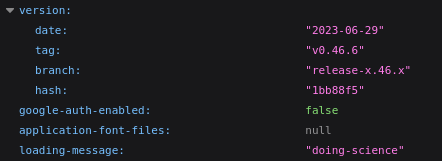

------------------


Analytics es una maquina de dificultad facil que se encuentra retirada en la plataforma de Hack The Box, en la cual explotamos Metabase (CVE-2023-38646), escapamos de un cotenedor de Docker mediante Information Leakage y escalamos a root mediante la explotatcion del Kernel - GameOver(lay)

--------------------------
# [](#header-1) Reconocimiento 
Comienzo con un nmap para saber que puertos se encuentran abiertos
```bash
❯ nmap -p- --open -sS --min-rate 5000 -vvv -n -Pn 10.10.11.233 -oG allPorts
Host discovery disabled (-Pn). All addresses will be marked 'up' and scan times may be slower.
Starting Nmap 7.94SVN ( https://nmap.org ) at 2024-09-11 09:39 -03
Initiating SYN Stealth Scan at 09:39
Scanning 10.10.11.233 [65535 ports]
Discovered open port 22/tcp on 10.10.11.233
Discovered open port 80/tcp on 10.10.11.233
Completed SYN Stealth Scan at 09:39, 16.14s elapsed (65535 total ports)
Nmap scan report for 10.10.11.233
Host is up, received user-set (0.27s latency).
Scanned at 2024-09-11 09:39:10 -03 for 16s
Not shown: 64773 closed tcp ports (reset), 760 filtered tcp ports (no-response)
Some closed ports may be reported as filtered due to --defeat-rst-ratelimit
PORT   STATE SERVICE REASON
22/tcp open  ssh     syn-ack ttl 63
80/tcp open  http    syn-ack ttl 63
```
- *-p-*: escanear todo el rango total de puertos(65535)
- *--open*:Reportar puertos abiertos, ya que los puertos pueden estar cerrado o filtrados.
- *-sS*:TCP SYN port scan, este es un modo para ir de forma rápido agresivo a la vez que sigiloso
- *--min-rate 5000*:Le indicamos que queremos que nos tramite paquetes nomas lento que 5000 paquete por segundo
- *-vvv*: Triple vervose para que puerto que nos detecte abierto nos lo vaya reportando sobre la marcha
- *-n*: Para no aplicar resolución DNS
- *-Pn*: Omitir la prueba de ping y simplemente escanea todos los hosts de destino proporcionados
- *-oG*:Para que nos cree un archivo grepeable, para poder filtrar por lo que nos interese mediante el empleo de expresiones regulares 

Veo que tiene el puerto 22, 80 por lo tanto voy a hacer un escaneo mas exhaustivo sobre estos puertos

```bash
❯ nmap -p22,80 -sCV 10.10.11.233 -oN targeted
Starting Nmap 7.94SVN ( https://nmap.org ) at 2024-09-11 09:47 -03
Nmap scan report for 10.10.11.233
Host is up (0.30s latency).

PORT   STATE SERVICE VERSION
22/tcp open  ssh     OpenSSH 8.9p1 Ubuntu 3ubuntu0.4 (Ubuntu Linux; protocol 2.0)
| ssh-hostkey: 
|   256 3e:ea:45:4b:c5:d1:6d:6f:e2:d4:d1:3b:0a:3d:a9:4f (ECDSA)
|_  256 64:cc:75:de:4a:e6:a5:b4:73:eb:3f:1b:cf:b4:e3:94 (ED25519)
80/tcp open  http    nginx 1.18.0 (Ubuntu)
|_http-title: Did not follow redirect to http://analytical.htb/
|_http-server-header: nginx/1.18.0 (Ubuntu)
Service Info: OS: Linux; CPE: cpe:/o:linux:linux_kernel
```
- *-p22,80*: Le indicamos que queremos escanear los puerto 22,80
- *-sCV*: Le indicamos con que queremos lanzar un script básicos de reconocimiento y, detectar la versión y servicios que corren para los puertos 20,80 y 8000
- *-oN*: Exportarlo en forma normal tal y como nos lo reporta Nmap

Veo que por el puerto 22 esta `SSH` que nos reporta el condéname(8.9p1 Ubuntu 3ubuntu0.4) de Ubuntu y gracias a esto puedo descubrir que estamos frente a un `Ubuntu jammy`, mas de eso por aquí no puedo hacer nada, en el puerto 80 veo que hay una pagina webque nos redirige a `analytical.htb` por lo tanto a esto lo introduzco en el `/etc/hosts` porque de primera nuestra maquina no sabe lo que es `http://analytical.htb/` 


Con  `Whatweb` voy a ver las tecnologías que corre por detrás de esta pagina web, no veo nada interesante mas allá de un par de correos que pueden a llegar a ser usuarios validos del sistema

```bash
❯ whatweb http://analytical.htb
http://analytical.htb [200 OK] Bootstrap, Country[RESERVED][ZZ], Email[demo@analytical.com,due@analytical.com], Frame, HTML5, HTTPServer[Ubuntu Linux][nginx/1.18.0 (Ubuntu)], IP[10.10.11.233], JQuery[3.0.0], Script, Title[Analytical], X-UA-Compatible[IE=edge], nginx[1.18.0]
```
Ahora voy a ver que contiene esta pagina web, veo una pagina estática haciendo `hovering` por home, about, team, services y contact me llevan a la misma pagina, lo que me interesa es login 


Que me lleva a un subdominio `data.analytical.htb`, por lo tanto lo añadire a mi `/etc/hosts`


Por lo tanto ahora veo la pagina de login, buscar lo que es [Metabase](https://www.metabiblioteca.com/metabase/) y veré si existe algún exploit 


Veo que existe un [CVE-2023-38646](https://github.com/m3m0o/metabase-pre-auth-rce-poc) para la versión 0.46.6 la cual me permite RCE sin estar autenticado 


La cual nos pide la URL y el valor de `setup-token` el cual lo podemos obtener de la ruta ``
`/api/session/properties` compruebo en la web veo que si existe esta ruta


Gracias a estotambien puedo ver la versión



Haciéndole un curl y grepeando por el token podemos ver el valor del setup-token 


## [](#header-2) Explotación - User
Para entender lo que esta haciendo este script en Python lo pasare  por burpsuite, veo que esta enviando una solicitud por post el cual esta lanzando un payload en json con el cual esta intentando lanzar un comando


Por lo tanto voy a definir un proxy


Por lo tanto ahora lanzamos el script con lo que nos pide, Url,Token y el comando


Entonces intercepto la solicitud


Lo que veo que se envía una solicitud al endpoint `/api/setup/validate`y que en parte le hace una inyección, lo pase nuestro comando en base64 lo de decodifica y lo ejecuta con bash 


- *Explicacion mas en profundidad* :
- En el campo `"db"` se está inyectando un payload en SQL para explotar la funcionalidad de la base de datos H2.
- `TRACE_LEVEL_SYSTEM_OUT=0`: Podría estar ajustando los niveles de trazas para ocultar actividades maliciosas.
- `CREATE TRIGGER`: Se está creando un "trigger" en la base de datos que se ejecutará **antes de cualquier consulta** a la tabla `INFORMATION_SCHEMA.TABLES`, lo que puede dar acceso a información confidencial del esquema.
- **Ejecución de comandos**: Se está utilizando `java.lang.Runtime.getRuntime().exec()` para ejecutar un comando Bash en el servidor vulnerable. Está decodificando un comando codificado en Base64 (`d2hvYWlp` que decodificado es `whoami`), y luego lo ejecuta en el shell Bash. Pueden ver y entender mejor como se descubrió esta [vulnerabilidad](https://www.assetnote.io/resources/research/chaining-our-way-to-pre-auth-rce-in-metabase-cve-2023-38646) 
Al darle al forward no veo el comando `whoami` ejecutado a nivel de sistema, como no veo la respuesta pero si se ejecuta podría verlo enviando un ping a mi maquina y ver si con `tcpdump` recibo el ping


Veo que efectivamente la maquina victima me envía un ping, por lo tanto se acontece el RCE


Ahora me pongo en escucha por el puerto 443 y me envio la revershell


Como vemos estamos dentro de un contendor


Veo que existe un archivo `.dockerenv`  pero esta vacío 


Entonces si existen variables de entornos las podría ver con el comando `env` y vemos que si hay algo en este caso veo un usuario y contraseña, entonces probare si es que me deja conectar mediante `SSH`


Las credenciales funcionan para conectarnos por SSH por lo tanto ahora podemos ver la flag de user


```bash
metalytics@analytics:~$ cat user.txt 
*********************0d0198
```

## [](#header-2) Root
Ahora buscare la manera de escalar a root, veo que con no tengo ningún grupo asignado del que nos podemos aprovechar, tampoco tenemos privilegio a nivel de sudoers, al igual que tampoco tenemos algun permiso SUID del que me pueda aprovechar y demás, pero veo que la versión de kernel si explotable 


[CVE-2023-2640-CVE-2023-32629](https://github.com/g1vi/CVE-2023-2640-CVE-2023-32629) Esto explota [OverlayFS](https://wiki.archlinux.org/title/Overlay_filesystem_(Espa%C3%B1ol)) por lo tanto nos descargamos el exploit en nuestra maquina de atacante y nos los transferimos a la maquina victima


nos montamos un servidor con python por el puerto 80
```bash
❯ python3 -m http.server 80
Serving HTTP on 0.0.0.0 port 80 (http://0.0.0.0:80/) ...
```
Y lo descargamos en la maquina victima


le damos permisos de ejecución y lo ejecutamos


Obtenemos acceso como root y ya podemos leer la flag de root
```bash
root@analytics:/root# cat root.txt 
*******************b4839d9
```

